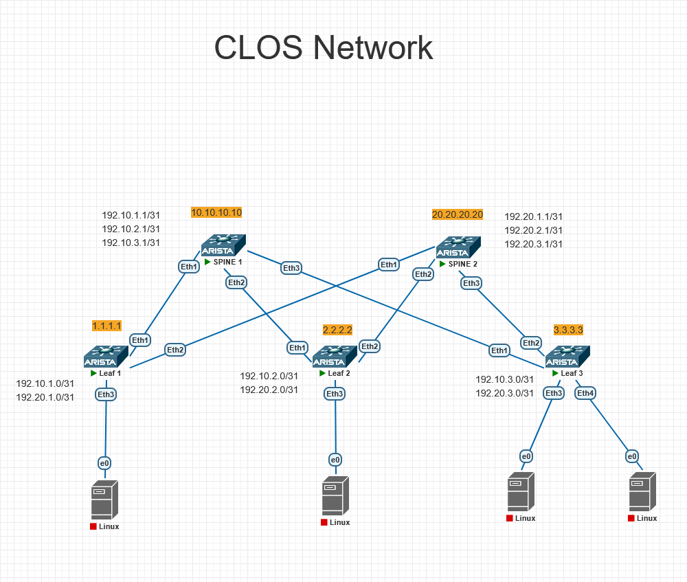

# Проектирование адресного пространства
## Цель: собрать схему CLOS и распределить адресное пространство.

# План работы
## 1. Собрать топологию CLOS
## 2. Распределить адресное пространство для Underlay сети
## 3. Настройки Arista

-------

## 1. Собрать топологию CLOS
    В проекте будет использоваться CLOS сеть состоящая из двух SPINE и трех Leaf. 

Схема подключения указана на рисунке 1

Рисунок 1.

## 2. Распределить адресное пространство для Underlay сети
- Loopback0 на каждом устройстве 
- Транзитные /31 сети на каждом линке Leaf-Spine.

### Loopback (Router ID / идентификация)
| Устройство | Loopback IP |
|------------|-------------|
| Leaf01 | 1.1.1.1/32 |
| Leaf02 | 2.2.2.2/32 |
| Leaf03 | 3.3.3.3/32 |
| Spine01 | 10.10.10.10/32 |
| Spine02 | 20.20.20.20/32 |

### Транзитные /31 линки (Leaf ↔ Spine)
| Линк |	IP Leaf |	IP Spine |
|------|------------|------------|
| Leaf01 – Spine01 |	192.10.1.0/31 |	192.10.1.1/31 |
| Leaf01 – Spine02 |	192.20.1.0/31 |	192.20.1.1/31 |
| Leaf02 – Spine01 |	192.10.2.0/31 |	192.10.2.1/31 |
| Leaf02 – Spine02 |	192.20.2.0/31 |	192.20.2.1/31 |
| Leaf03 – Spine01 |	192.10.3.0/31 |	192.10.3.1/31 |
| Leaf03 – Spine02 |	192.20.3.0/31 |	192.20.3.1/31 |

Все Leaf соединены с обоими Spine. Всего 6 линков.

#### Формирование IP адреса
- 192 - сеть
- 10 или 20 - номер spine (последний октет, где 10 - Spine01, а 20 - Spine02)
- 1 или 2 или 3 - номер Leaf (последний октет, где 1 - Leaf01,  2 - Leaf02, 3 - Leaf03)


## 3. Настройки Arista
### Leaf1
```bash
configure
hostname Leaf01

interface Loopback0
   ip address 1.1.1.1/32   # Уникальный ID для OSPF/BGP/MPLS

interface Ethernet1
   description to-Spine01-Eth1
   no switchport 
   ip address 192.10.1.0/31 
   no shutdow

interface Ethernet2
   description to-Spine02-Eth2
   no switchport 
   ip address 192.20.1.0/31 
   no shutdown
end
write momory
```
-----

### Leaf2
```bash
configure
hostname Leaf02

interface Loopback0
   ip address 2.2.2.2/32   # Уникальный ID для OSPF/BGP/MPLS

interface Ethernet1
   description to-Spine01-Eth1
   no switchport 
   ip address 192.10.2.0/31 
   no shutdown

interface Ethernet2
   description to-Spine02-Eth2
   no switchport 
   ip address 192.20.2.0/31 
   no shutdown
end
write momory
```
--------

### Leaf3
```bash
configure
hostname Leaf03

interface Loopback0
   ip address 3.3.3.3/32   # Уникальный ID для OSPF/BGP/MPLS

interface Ethernet1
   description to-Spine01-Eth1
   no switchport 
   ip address 192.10.3.0/31 
   no shutdown

interface Ethernet2
   description to-Spine02-Eth2
   no switchport 
   ip address 192.20.3.0/31 
   no shutdown
end
write momory
```
----------

### Spine1
```bash
configure
hostname Spine01

    interface Loopback0
    ip address 10.10.10.10/32  

	interface Ethernet1
	description to-Leaf01-Eth1
	no switchport
	ip address 192.10.1.1/31 
	no shutdown

 	interface Ethernet2
	description to-Leaf02-Eth2
	no switchport
	ip address 192.10.2.1/31 
	no shutdown

 	interface Ethernet3
	description to-Leaf03-Eth3
	no switchport
	ip address 192.10.3.1/31 
	no shutdown
end
write memory
```
--------

### Spine2
```bash
configure
hostname Spine02

    interface Loopback0
    ip address 20.20.20.20/32  

	interface Ethernet1
	description to-Leaf01-Eth1
	no switchport
	ip address 192.20.1.1/31 
	no shutdown

 	interface Ethernet2
	description to-Leaf02-Eth2
	no switchport
	ip address 192.20.2.1/31 
	no shutdown

 	interface Ethernet3
	description to-Leaf03-Eth3
	no switchport
	ip address 192.20.3.1/31 
	no shutdown
end
write memory
```
