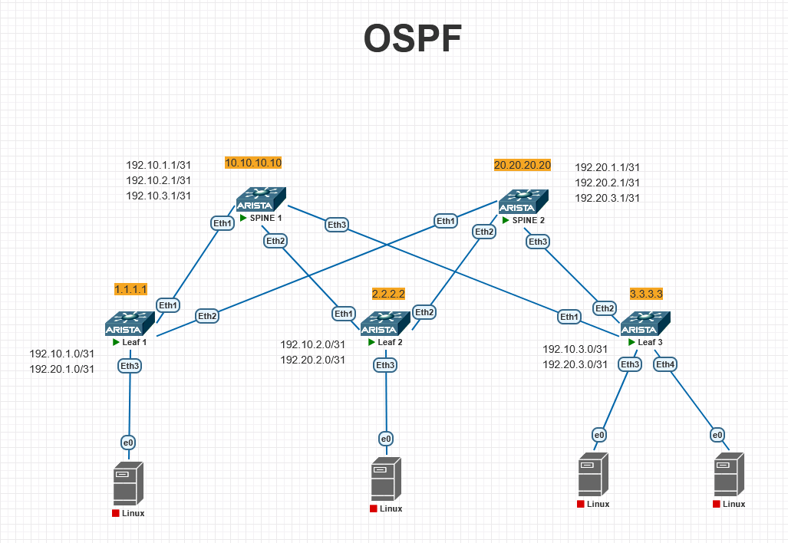

# Underlay. OSPF
## Цель: настроить OSPF для Underlay сети.

# План работы
## 1. Назначение IP-адресов:
### 1.1 Loopback 0 на каждом устройстве (для Router ID и стабильных соединений).
### 1.2 Транзитные /31 сети на каждом линке Leaf-Spine.
## 2. Настройка OSPF
## 3. Верификация: проверка соседств, таблиц маршрутизации и связанности.

-------

## 1. Назначение IP-адресов:
    В проекте будет использоваться CLOS сеть состоящая из двух SPINE и трех Leaf. 

Схема подключения указана на рисунке 1

Рисунок 1.

### 1.1 Loopback 0 на каждом устройстве (для Router ID и стабильных соединений).
Loopback0 на каждом устройстве 

#### Loopback (Router ID / идентификация)
| Устройство | Loopback IP |
|------------|-------------|
| Leaf01 | 1.1.1.1/32 |
| Leaf02 | 2.2.2.2/32 |
| Leaf03 | 3.3.3.3/32 |
| Spine01 | 10.10.10.10/32 |
| Spine02 | 20.20.20.20/32 |

### 1.2 Транзитные /31 сети на каждом линке Leaf-Spine.
Транзитные /31 сети на каждом линке Leaf-Spine.

#### Транзитные /31 линки (Leaf ↔ Spine)
| Линк |	IP Leaf |	IP Spine |
|------|------------|------------|
| Leaf01 – Spine01 |	192.10.1.0/31 |	192.10.1.1/31 |
| Leaf01 – Spine02 |	192.20.1.0/31 |	192.20.1.1/31 |
| Leaf02 – Spine01 |	192.10.2.0/31 |	192.10.2.1/31 |
| Leaf02 – Spine02 |	192.20.2.0/31 |	192.20.2.1/31 |
| Leaf03 – Spine01 |	192.10.3.0/31 |	192.10.3.1/31 |
| Leaf03 – Spine02 |	192.20.3.0/31 |	192.20.3.1/31 |

Все Leaf соединены с обоими Spine. Всего 6 линков.

#### Формирование IP адреса
192 сеть
10 или 20 номер spine (последний октет, где 10 Spine01, а 20 Spine02)
1 или 2 или 3 номер Leaf (последний октет, где 1 Leaf01,  2 Leaf02, 3 Leaf03)


## 2. Настройка OSPF

### Leaf1
```bash
configure
hostname Leaf01
ip routing

interface Loopback0
   ip address 1.1.1.1/32   # Уникальный ID для OSPF/BGP/MPLS
   ip ospf Area 0
   no shutdown

interface Ethernet1
    description to-Spine01-Eth1
    no switchport 
    no shutdow 
    ip address 192.10.1.0/31 
    ip ospf Area 0
    ip ospf network point-to-poin
 	mtu 9214 


interface Ethernet2
    description to-Spine02-Eth2
    no switchport 
    ip address 192.20.1.0/31 
    no shutdown
    ip ospf Area 0
    ip ospf network point-to-poin
 	mtu 9214 

router ospf 1
 router-id 1.1.1.1
 network 1.1.1.1/32 area 0
 network 192.10.1.0/31 area 0
 network 192.20.1.0/31 area 0

end
write momory
```
-----

### Leaf2
```bash
configure
hostname Leaf02
ip routing

interface Loopback0
    ip address 2.2.2.2/32   # Уникальный ID для OSPF/BGP/MPLS
    ip ospf Area 0
    no shutdown 

interface Ethernet1
    description to-Spine01-Eth1confq
	no switchport 
    no shutdown 
    ip address 192.10.2.0/31 
    ip ospf Area 0
    ip ospf network point-to-poin
 	mtu 9214  


interface Ethernet2
    description to-Spine02-Eth2
    no switchport 
    no shutdown 
    ip address 192.20.2.0/31 
    ip ospf Area 0
    ip ospf network point-to-poin
 	mtu 9214   

router ospf 1
 router-id 2.2.2.2
 network 2.2.2.2/32 area 0
 network 192.10.2.0/31 area 0
 network 192.20.2.0/31 area 0

end
write momory
```
------

### Leaf3
```bash
configure
hostname Leaf03
ip routing

interface Loopback0
	ip address 3.3.3.3/32   # Уникальный ID для OSPF/BGP/MPLS
    ip ospf Area 0
    no shutdown  

interface Ethernet1
    description to-Spine01-Eth1
    no switchport 
    no shutdown 
    ip address 192.10.3.0/31
    ip ospf Area 0
    ip ospf network point-to-poin
 	mtu 9214    


interface Ethernet2
    description to-Spine02-Eth2
    no switchport
    no shutdown  
    ip address 192.20.3.0/31 
    no shutdown
    ip ospf Area 0
    ip ospf network point-to-poin
 	mtu 9214   

router ospf 1
 router-id 3.3.3.3
 network 3.3.3.3/32 area 0
 network 192.10.3.0/31 area 0
 network 192.20.3.0/31 area 0

end
write momory
```
-----

### Spine1
```bash
configure
ip routing
hostname Spine01

interface Loopback0
    ip address 10.10.10.10/32  
    ip ospf area 0.0.0.0

interface Ethernet1
    description to-Leaf01-Eth1
	no switchport
    no shutdown
    ip address 192.10.1.1/31 
    ip ospf area 0.0.0.0
	ip ospf network point-to-point
	mtu 9214


interface Ethernet2
    description to-Leaf02-Eth2
    no switchport
    no shutdown
    ip address 192.10.2.1/31 
	ip ospf area 0.0.0.0
	ip ospf network point-to-point
 	mtu 9214 


interface Ethernet3
    description to-Leaf03-Eth3
    no switchport
    no shutdown
    ip address 192.10.3.1/31 
	ip ospf area 0.0.0.0
	ip ospf network point-to-point
 	mtu 9214 

router ospf 1
 router-id 10.10.10.10
 network 10.10.10.10/32 area 0
 network 192.10.1.0/31 area 0
 network 192.10.2.0/31 area 0
 network 192.10.3.0/31 area 0

end
write memory
```
---------

### Spine2
```bash
OSPF Spine02
configure
ip routing
hostname Spine02

interface Loopback0
   ip address 20.20.20.20/32
   ip ospf area 0.0.0.0

interface Ethernet1
 	description to-Leaf01-Eth1
	no switchport
    no shutdown
	ip address 192.20.1.1/31
    ip ospf area 0.0.0.0
    ip ospf network point-to-point
 	mtu 9214 


interface Ethernet2
  	description to-Leaf02-Eth2
	no switchport
    no shutdown 
    ip address 192.20.2.1/31
    ip ospf area 0.0.0.0
    ip ospf network point-to-point
 	mtu 9214 

interface Ethernet3
  	description to-Leaf03-Eth3
	no switchport
    no shutdown 
    ip address 192.20.3.1/31
    ip ospf area 0.0.0.0
    ip ospf network point-to-point
 	mtu 9214 

router ospf 1
 router-id 20.20.20.20
 network 20.20.20.20/32 area 0
 network 192.20.1.0/31 area 0
 network 192.20.2.0/31 area 0
 network 192.20.3.0/31 area 0

end
write memory
```

## 3. Верификация: проверка соседств, таблиц маршрутизации и связанности.
### Spine01
#### show ip ospf neighbor
Spine01#show ip ospf neighbor

| Neighbor ID | Instance |  VRF | Pri | State | Dead Time | Address | Interface |
| ----------| -------| ---| --| ----| --------| ------| --------|
|3.3.3.3 | 1 | default | 0 | FULL | 00:00:37 | 192.10.3.0 | Ethernet3 |
| 1.1.1.1 | 1 | default | 0 | FULL | 00:00:34 | 192.10.1.0 | Ethernet1 |
| 2.2.2.2 | 1 | default | 0 | FULL | 00:00:31 | 192.10.2.0 | Ethernet2 |
----
#### show ip route ospf
```
Spine01#show ip route ospf
O        1.1.1.1/32 [110/20] via 192.10.1.0, Ethernet1
O        2.2.2.2/32 [110/20] via 192.10.2.0, Ethernet2
O        3.3.3.3/32 [110/20] via 192.10.3.0, Ethernet3
O        20.20.20.20/32 [110/30] via 192.10.1.0, Ethernet1
                                  via 192.10.2.0, Ethernet2
                                  via 192.10.3.0, Ethernet3
O        192.20.1.0/31 [110/20] via 192.10.1.0, Ethernet1
O        192.20.2.0/31 [110/20] via 192.10.2.0, Ethernet2
O        192.20.3.0/31 [110/20] via 192.10.3.0, Ethernet3
```
----
#### ping
```
Spine01#ping 1.1.1.1 source 10.10.10.10
PING 1.1.1.1 (1.1.1.1) from 10.10.10.10 : 72(100) bytes of data.
80 bytes from 1.1.1.1: icmp_seq=1 ttl=64 time=7.59 ms
80 bytes from 1.1.1.1: icmp_seq=2 ttl=64 time=3.45 ms
80 bytes from 1.1.1.1: icmp_seq=3 ttl=64 time=3.04 ms
80 bytes from 1.1.1.1: icmp_seq=4 ttl=64 time=3.38 ms
80 bytes from 1.1.1.1: icmp_seq=5 ttl=64 time=4.06 ms
```
----
```
Spine01#ping 2.2.2.2 source 10.10.10.10
PING 2.2.2.2 (2.2.2.2) from 10.10.10.10 : 72(100) bytes of data.
80 bytes from 2.2.2.2: icmp_seq=1 ttl=64 time=6.07 ms
80 bytes from 2.2.2.2: icmp_seq=2 ttl=64 time=4.02 ms
80 bytes from 2.2.2.2: icmp_seq=3 ttl=64 time=3.23 ms
80 bytes from 2.2.2.2: icmp_seq=4 ttl=64 time=3.06 ms
80 bytes from 2.2.2.2: icmp_seq=5 ttl=64 time=3.91 ms
```
----
```
Spine01#ping 3.3.3.3 source 10.10.10.10
PING 3.3.3.3 (3.3.3.3) from 10.10.10.10 : 72(100) bytes of data.
80 bytes from 3.3.3.3: icmp_seq=1 ttl=64 time=6.02 ms
80 bytes from 3.3.3.3: icmp_seq=2 ttl=64 time=4.40 ms
80 bytes from 3.3.3.3: icmp_seq=3 ttl=64 time=4.54 ms
80 bytes from 3.3.3.3: icmp_seq=4 ttl=64 time=3.23 ms
80 bytes from 3.3.3.3: icmp_seq=5 ttl=64 time=3.09 ms
```
----
```
Spine01#ping 20.20.20.20 source 10.10.10.10
PING 20.20.20.20 (20.20.20.20) from 10.10.10.10 : 72(100) bytes of data.
80 bytes from 20.20.20.20: icmp_seq=1 ttl=63 time=10.9 ms
80 bytes from 20.20.20.20: icmp_seq=2 ttl=63 time=9.60 ms
80 bytes from 20.20.20.20: icmp_seq=3 ttl=63 time=7.64 ms
80 bytes from 20.20.20.20: icmp_seq=4 ttl=63 time=7.04 ms
80 bytes from 20.20.20.20: icmp_seq=5 ttl=63 time=6.89 ms
```
----

### Spine02
#### show ip ospf neighbor

Spine02#show ip ospf neighbor
| Neighbor ID | Instance |  VRF | Pri | State | Dead Time | Address | Interface |
| ----------| -------| ---| --| ----| --------| ------| --------|
| 1.1.1.1 | 1 | default | 0 | FULL | 00:00:32 | 192.20.1.0 | Ethernet1 |
| 2.2.2.2 | 1 | default | 0 | FULL | 00:00:36 | 192.20.2.0 | Ethernet2 |
| 3.3.3.3 | 1 | default | 0 | FULL | 00:00:35 | 192.20.3.0 | Ethernet3 |
-----
#### show ip route ospf
```
Spine02#show ip route ospf
O        1.1.1.1/32 [110/20] via 192.20.1.0, Ethernet1
O        2.2.2.2/32 [110/20] via 192.20.2.0, Ethernet2
O        3.3.3.3/32 [110/20] via 192.20.3.0, Ethernet3
O        10.10.10.10/32 [110/30] via 192.20.1.0, Ethernet1
                                  via 192.20.2.0, Ethernet2
                                  via 192.20.3.0, Ethernet3
O        192.10.1.0/31 [110/20] via 192.20.1.0, Ethernet1
O        192.10.2.0/31 [110/20] via 192.20.2.0, Ethernet2
O        192.10.3.0/31 [110/20] via 192.20.3.0, Ethernet3
```
----
#### ping
```
Spine02#ping 1.1.1.1 source 20.20.20.20
PING 1.1.1.1 (1.1.1.1) from 20.20.20.20 : 72(100) bytes of data.
80 bytes from 1.1.1.1: icmp_seq=1 ttl=64 time=7.04 ms
80 bytes from 1.1.1.1: icmp_seq=2 ttl=64 time=4.09 ms
80 bytes from 1.1.1.1: icmp_seq=3 ttl=64 time=2.97 ms
80 bytes from 1.1.1.1: icmp_seq=4 ttl=64 time=4.67 ms
80 bytes from 1.1.1.1: icmp_seq=5 ttl=64 time=3.97 ms
```
-----
```
Spine02#ping 2.2.2.2 source 20.20.20.20
PING 2.2.2.2 (2.2.2.2) from 20.20.20.20 : 72(100) bytes of data.
80 bytes from 2.2.2.2: icmp_seq=1 ttl=64 time=4.73 ms
80 bytes from 2.2.2.2: icmp_seq=2 ttl=64 time=3.81 ms
80 bytes from 2.2.2.2: icmp_seq=3 ttl=64 time=3.63 ms
80 bytes from 2.2.2.2: icmp_seq=4 ttl=64 time=3.15 ms
80 bytes from 2.2.2.2: icmp_seq=5 ttl=64 time=2.98 ms
```
-----
```
Spine02#ping 3.3.3.3 source 20.20.20.20
PING 3.3.3.3 (3.3.3.3) from 20.20.20.20 : 72(100) bytes of data.
80 bytes from 3.3.3.3: icmp_seq=1 ttl=64 time=5.17 ms
80 bytes from 3.3.3.3: icmp_seq=2 ttl=64 time=4.04 ms
80 bytes from 3.3.3.3: icmp_seq=3 ttl=64 time=4.15 ms
80 bytes from 3.3.3.3: icmp_seq=4 ttl=64 time=7.76 ms
80 bytes from 3.3.3.3: icmp_seq=5 ttl=64 time=3.66 ms
```
----
```
Spine02#ping 10.10.10.10 source 20.20.20.20
PING 10.10.10.10 (10.10.10.10) from 20.20.20.20 : 72(100) bytes of data.
80 bytes from 10.10.10.10: icmp_seq=1 ttl=63 time=46.0 ms
80 bytes from 10.10.10.10: icmp_seq=2 ttl=63 time=39.0 ms
80 bytes from 10.10.10.10: icmp_seq=3 ttl=63 time=31.4 ms
80 bytes from 10.10.10.10: icmp_seq=4 ttl=63 time=23.9 ms
80 bytes from 10.10.10.10: icmp_seq=5 ttl=63 time=7.36 ms
```
----

### Leaf01
#### show ip ospf neighbor
Leaf01#show ip ospf neighbor
| Neighbor ID | Instance |  VRF | Pri | State | Dead Time | Address | Interface |
| ----------| -------| ---| --| ----| --------| ------| --------|
| 10.10.10.10 | 1 | default | 0 | FULL | 00:00:33 | 192.10.1.1 | Ethernet1 |
| 20.20.20.20 | 1 | default | 0 | FULL | 00:00:36 | 192.20.1.1 | Ethernet2 |
----
#### ip route ospf
```
Leaf01#show ip route ospf
O        2.2.2.2/32 [110/30] via 192.10.1.1, Ethernet1
                              via 192.20.1.1, Ethernet2
O        3.3.3.3/32 [110/30] via 192.10.1.1, Ethernet1
                              via 192.20.1.1, Ethernet2
O        10.10.10.10/32 [110/20] via 192.10.1.1, Ethernet1
O        20.20.20.20/32 [110/20] via 192.20.1.1, Ethernet2
O        192.10.2.0/31 [110/20] via 192.10.1.1, Ethernet1
O        192.10.3.0/31 [110/20] via 192.10.1.1, Ethernet1
O        192.20.2.0/31 [110/20] via 192.20.1.1, Ethernet2
O        192.20.3.0/31 [110/20] via 192.20.1.1, Ethernet2
```
----
#### ping
```
Leaf01#ping 2.2.2.2 source 1.1.1.1
PING 2.2.2.2 (2.2.2.2) from 1.1.1.1 : 72(100) bytes of data.
80 bytes from 2.2.2.2: icmp_seq=1 ttl=63 time=10.4 ms
80 bytes from 2.2.2.2: icmp_seq=2 ttl=63 time=9.39 ms
80 bytes from 2.2.2.2: icmp_seq=3 ttl=63 time=6.77 ms
80 bytes from 2.2.2.2: icmp_seq=4 ttl=63 time=7.49 ms
80 bytes from 2.2.2.2: icmp_seq=5 ttl=63 time=7.76 ms
```
----
```
Leaf01#ping 3.3.3.3 source 1.1.1.1
PING 3.3.3.3 (3.3.3.3) from 1.1.1.1 : 72(100) bytes of data.
80 bytes from 3.3.3.3: icmp_seq=1 ttl=63 time=9.46 ms
80 bytes from 3.3.3.3: icmp_seq=2 ttl=63 time=7.34 ms
80 bytes from 3.3.3.3: icmp_seq=3 ttl=63 time=6.51 ms
80 bytes from 3.3.3.3: icmp_seq=4 ttl=63 time=6.41 ms
80 bytes from 3.3.3.3: icmp_seq=5 ttl=63 time=7.18 ms
```
----
```
Leaf01#ping 10.10.10.10 source 1.1.1.1
PING 10.10.10.10 (10.10.10.10) from 1.1.1.1 : 72(100) bytes of data.
80 bytes from 10.10.10.10: icmp_seq=1 ttl=64 time=6.57 ms
80 bytes from 10.10.10.10: icmp_seq=2 ttl=64 time=4.83 ms
80 bytes from 10.10.10.10: icmp_seq=3 ttl=64 time=4.12 ms
80 bytes from 10.10.10.10: icmp_seq=4 ttl=64 time=3.24 ms
80 bytes from 10.10.10.10: icmp_seq=5 ttl=64 time=4.53 ms
```
----
```
Leaf01#ping 20.20.20.20 source 1.1.1.1
PING 20.20.20.20 (20.20.20.20) from 1.1.1.1 : 72(100) bytes of data.
80 bytes from 20.20.20.20: icmp_seq=1 ttl=64 time=5.16 ms
80 bytes from 20.20.20.20: icmp_seq=2 ttl=64 time=4.14 ms
80 bytes from 20.20.20.20: icmp_seq=3 ttl=64 time=4.27 ms
80 bytes from 20.20.20.20: icmp_seq=4 ttl=64 time=4.39 ms
80 bytes from 20.20.20.20: icmp_seq=5 ttl=64 time=3.65 ms
```
### Leaf02
#### show ip ospf neighbor
Leaf02> show ip ospf neighbor
| Neighbor ID | Instance |  VRF | Pri | State | Dead Time | Address | Interface |
| ----------| -------| ---| --| ----| --------| ------| --------|
| 10.10.10.10 | 1 | default | 0 | FULL | 00:00:33 | 192.10.2.1 | Ethernet1 |
| 20.20.20.20 | 1 | default | 0 | FULL | 00:00:36 | 192.20.2.1 | Ethernet2 |
----
#### ip route ospf
```
Leaf02>show ip route ospf
O        1.1.1.1/32 [110/30] via 192.10.2.1, Ethernet1
                              via 192.20.2.1, Ethernet2
O        3.3.3.3/32 [110/30] via 192.10.2.1, Ethernet1
                              via 192.20.2.1, Ethernet2
O        10.10.10.10/32 [110/20] via 192.10.2.1, Ethernet1
O        20.20.20.20/32 [110/20] via 192.20.2.1, Ethernet2
O        192.10.1.0/31 [110/20] via 192.10.2.1, Ethernet1
O        192.10.3.0/31 [110/20] via 192.10.2.1, Ethernet1
O        192.20.1.0/31 [110/20] via 192.20.2.1, Ethernet2
O        192.20.3.0/31 [110/20] via 192.20.2.1, Ethernet2
```
----
#### ping
```
Leaf02#ping 1.1.1.1 source 2.2.2.2
PING 1.1.1.1 (1.1.1.1) from 2.2.2.2 : 72(100) bytes of data.
80 bytes from 1.1.1.1: icmp_seq=1 ttl=63 time=9.59 ms
80 bytes from 1.1.1.1: icmp_seq=2 ttl=63 time=7.40 ms
80 bytes from 1.1.1.1: icmp_seq=3 ttl=63 time=8.52 ms
80 bytes from 1.1.1.1: icmp_seq=4 ttl=63 time=7.72 ms
80 bytes from 1.1.1.1: icmp_seq=5 ttl=63 time=11.3 ms
```
----
```
Leaf02#ping 3.3.3.3 source 2.2.2.2
PING 3.3.3.3 (3.3.3.3) from 2.2.2.2 : 72(100) bytes of data.
80 bytes from 3.3.3.3: icmp_seq=1 ttl=63 time=12.0 ms
80 bytes from 3.3.3.3: icmp_seq=2 ttl=63 time=8.02 ms
80 bytes from 3.3.3.3: icmp_seq=3 ttl=63 time=7.76 ms
80 bytes from 3.3.3.3: icmp_seq=4 ttl=63 time=7.58 ms
80 bytes from 3.3.3.3: icmp_seq=5 ttl=63 time=8.65 ms
```
---
```
Leaf02#ping 10.10.10.10 source 2.2.2.2
PING 10.10.10.10 (10.10.10.10) from 2.2.2.2 : 72(100) bytes of data.
80 bytes from 10.10.10.10: icmp_seq=1 ttl=64 time=5.73 ms
80 bytes from 10.10.10.10: icmp_seq=2 ttl=64 time=4.18 ms
80 bytes from 10.10.10.10: icmp_seq=3 ttl=64 time=4.23 ms
80 bytes from 10.10.10.10: icmp_seq=4 ttl=64 time=4.35 ms
80 bytes from 10.10.10.10: icmp_seq=5 ttl=64 time=4.27 ms
```
----
```
Leaf02#ping 20.20.20.20 source 2.2.2.2
PING 20.20.20.20 (20.20.20.20) from 2.2.2.2 : 72(100) bytes of data.
80 bytes from 20.20.20.20: icmp_seq=1 ttl=64 time=5.09 ms
80 bytes from 20.20.20.20: icmp_seq=2 ttl=64 time=4.30 ms
80 bytes from 20.20.20.20: icmp_seq=3 ttl=64 time=2.99 ms
80 bytes from 20.20.20.20: icmp_seq=4 ttl=64 time=3.29 ms
80 bytes from 20.20.20.20: icmp_seq=5 ttl=64 time=4.23 ms
```
----
### Leaf03
#### show ip ospf neighbor
Leaf03#show ip ospf neighbor
| Neighbor ID | Instance |  VRF | Pri | State | Dead Time | Address | Interface |
| ----------| -------| ---| --| ----| --------| ------| --------|
| 10.10.10.10 | 1 | default | 0 | FULL | 00:00:37 | 192.10.3.1 | Ethernet1 |
| 20.20.20.20 | 1 | default | 0 | FULL | 00:00:36 | 192.20.3.1 | Ethernet2 |
----
#### ip route ospf
```
Leaf03#show ip route ospf
O        1.1.1.1/32 [110/30] via 192.10.3.1, Ethernet1
                              via 192.20.3.1, Ethernet2
O        2.2.2.2/32 [110/30] via 192.10.3.1, Ethernet1
                              via 192.20.3.1, Ethernet2
O        10.10.10.10/32 [110/20] via 192.10.3.1, Ethernet1
O        20.20.20.20/32 [110/20] via 192.20.3.1, Ethernet2
O        192.10.1.0/31 [110/20] via 192.10.3.1, Ethernet1
O        192.10.2.0/31 [110/20] via 192.10.3.1, Ethernet1
O        192.20.1.0/31 [110/20] via 192.20.3.1, Ethernet2
O        192.20.2.0/31 [110/20] via 192.20.3.1, Ethernet2
```
----
#### ping
```
Leaf03#ping 1.1.1.1 source 3.3.3.3
PING 1.1.1.1 (1.1.1.1) from 3.3.3.3 : 72(100) bytes of data.
80 bytes from 1.1.1.1: icmp_seq=1 ttl=63 time=10.5 ms
80 bytes from 1.1.1.1: icmp_seq=2 ttl=63 time=7.60 ms
80 bytes from 1.1.1.1: icmp_seq=3 ttl=63 time=7.23 ms
80 bytes from 1.1.1.1: icmp_seq=4 ttl=63 time=7.41 ms
80 bytes from 1.1.1.1: icmp_seq=5 ttl=63 time=7.81 ms
```
----
```
Leaf03#ping 2.2.2.2 source 3.3.3.3
PING 2.2.2.2 (2.2.2.2) from 3.3.3.3 : 72(100) bytes of data.
80 bytes from 2.2.2.2: icmp_seq=1 ttl=63 time=15.7 ms
80 bytes from 2.2.2.2: icmp_seq=2 ttl=63 time=8.55 ms
80 bytes from 2.2.2.2: icmp_seq=3 ttl=63 time=11.5 ms
80 bytes from 2.2.2.2: icmp_seq=4 ttl=63 time=9.87 ms
80 bytes from 2.2.2.2: icmp_seq=5 ttl=63 time=7.89 ms
```
----
```
Leaf03#ping 10.10.10.10 source 3.3.3.3
PING 10.10.10.10 (10.10.10.10) from 3.3.3.3 : 72(100) bytes of data.
80 bytes from 10.10.10.10: icmp_seq=1 ttl=64 time=4.86 ms
80 bytes from 10.10.10.10: icmp_seq=2 ttl=64 time=4.52 ms
80 bytes from 10.10.10.10: icmp_seq=3 ttl=64 time=3.49 ms
80 bytes from 10.10.10.10: icmp_seq=4 ttl=64 time=4.69 ms
80 bytes from 10.10.10.10: icmp_seq=5 ttl=64 time=5.01 ms
```
----
```
Leaf03#ping 20.20.20.20 source 3.3.3.3  
PING 20.20.20.20 (20.20.20.20) from 3.3.3.3 : 72(100) bytes of data.  
80 bytes from 20.20.20.20: icmp_seq=1 ttl=64 time=5.02 ms  
80 bytes from 20.20.20.20: icmp_seq=2 ttl=64 time=4.35 ms  
80 bytes from 20.20.20.20: icmp_seq=3 ttl=64 time=4.69 ms  
80 bytes from 20.20.20.20: icmp_seq=4 ttl=64 time=3.28 ms  
80 bytes from 20.20.20.20: icmp_seq=5 ttl=64 time=3.87 ms  
```

