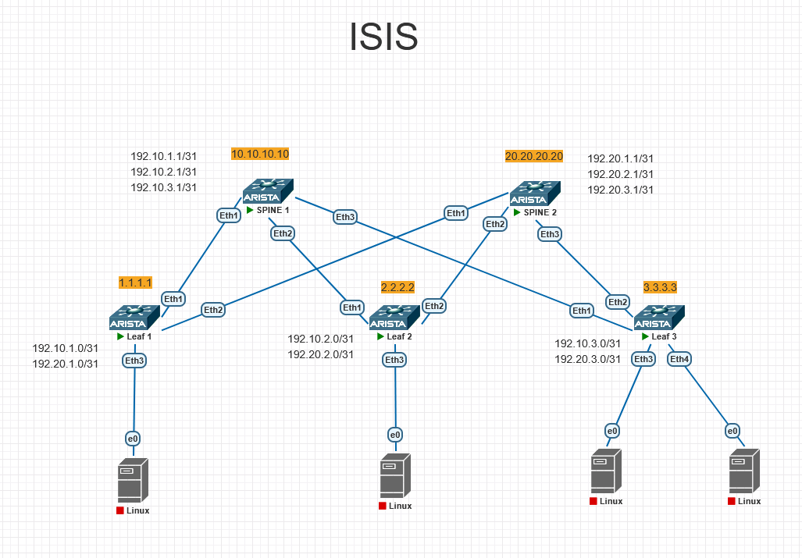

# Underlay. IS-IS
## Цель: настроить IS-IS для Underlay сети.

# План работы
## 1. Назначение IP-адресов:
### 1.1 Loopback 0 на каждом устройстве (для Router ID и стабильных соединений).
### 1.2 Транзитные /31 сети на каждом линке Leaf-Spine.
## 2. Настройка ISIS
## 3. Верификация: проверка соседств, таблиц маршрутизации и связанности.

-------

## 1. Назначение IP-адресов:
    В проекте будет использоваться CLOS сеть состоящая из двух SPINE и трех Leaf. 

Схема подключения указана на рисунке 1

Рисунок 1.

### 1.1 Loopback 0 на каждом устройстве (для Router ID и стабильных соединений).
Loopback0 на каждом устройстве 

#### Loopback (Router ID / идентификация)
| Устройство | Loopback IP |
|------------|-------------|
| Leaf01 | 1.1.1.1/32 |
| Leaf02 | 2.2.2.2/32 |
| Leaf03 | 3.3.3.3/32 |
| Spine01 | 10.10.10.10/32 |
| Spine02 | 20.20.20.20/32 |

### 1.2 Транзитные /31 сети на каждом линке Leaf-Spine.
Транзитные /31 сети на каждом линке Leaf-Spine.

#### Транзитные /31 линки (Leaf ↔ Spine)
| Линк |	IP Leaf |	IP Spine |
|------|------------|------------|
| Leaf01 – Spine01 |	192.10.1.0/31 |	192.10.1.1/31 |
| Leaf01 – Spine02 |	192.20.1.0/31 |	192.20.1.1/31 |
| Leaf02 – Spine01 |	192.10.2.0/31 |	192.10.2.1/31 |
| Leaf02 – Spine02 |	192.20.2.0/31 |	192.20.2.1/31 |
| Leaf03 – Spine01 |	192.10.3.0/31 |	192.10.3.1/31 |
| Leaf03 – Spine02 |	192.20.3.0/31 |	192.20.3.1/31 |

Все Leaf соединены с обоими Spine. Всего 6 линков.

#### Формирование IP адреса
192 сеть
10 или 20 номер spine (последний октет, где 10 Spine01, а 20 Spine02)
1 или 2 или 3 номер Leaf (последний октет, где 1 Leaf01,  2 Leaf02, 3 Leaf03)


## 2. Настройка ISIS
### Leaf01
```bash
configure
hostname Leaf01
ip routing

interface Loopback0
   ip address 1.1.1.1/32 
   no shutdown

interface Ethernet1
    description to-Spine01-Eth1
    no switchport 
    no shutdow 
    ip address 192.10.1.0/31 

interface Ethernet2
    description to-Spine02-Eth2
    no switchport 
    no shutdown 
    ip address 192.20.1.0/31 

router isis UNDERLAY
    net 49.0001.0010.0100.1001.00
    is-type level-2
    address-family ipv4 unicast

    interface Loopback0
        isis enable UNDERLAY
        isis passive

    interface Ethernet1
        isis enable UNDERLAY
        isis network point-to-point
        
    interface Ethernet2
        isis enable UNDERLAY
        isis network point-to-point

write memory
```
-----

### Leaf02
```bash
configure
hostname Leaf02
ip routing

interface Loopback0
   ip address 2.2.2.2/32   
   no shutdown

interface Ethernet1
    description to-Spine01-Eth1
    no switchport 
    no shutdow 
    ip address 192.10.2.0/31 

interface Ethernet2
    description to-Spine02-Eth2
    no switchport 
    no shutdown 
    ip address 192.20.2.0/31 

router isis UNDERLAY
    net 49.0001.0020.0200.2002.00
    is-type level-2
    address-family ipv4 unicast

    interface Loopback0
        isis enable UNDERLAY
        isis passive

    interface Ethernet1
        isis enable UNDERLAY
        isis network point-to-point
        
    interface Ethernet2
        isis enable UNDERLAY
        isis network point-to-point

write memory
```
------

### Leaf03
```bash
configure
hostname Leaf03
ip routing

interface Loopback0
   ip address 3.3.3.3/32  
   no shutdown

interface Ethernet1
    description to-Spine01-Eth1
    no switchport 
    no shutdow 
    ip address 192.10.3.0/31 

interface Ethernet2
    description to-Spine02-Eth2
    no switchport 
    no shutdown 
    ip address 192.20.3.0/31 

router isis UNDERLAY

    net 49.0001.0030.0300.3003.00
    is-type level-2
    address-family ipv4 unicast

    interface Loopback0
        isis enable UNDERLAY
        isis passive

    interface Ethernet1
        isis enable UNDERLAY
        isis network point-to-point
        
    interface Ethernet2
        isis enable UNDERLAY
        isis network point-to-point

write memory
```
----

### Spine01
```bash
configure
hostname Spine01
ip routing

interface Loopback0
   ip address 10.10.10.10/32  
   no shutdown

interface Ethernet1
    description to-Leaf01-Eth1
	no switchport
    no shutdown
    ip address 192.10.1.1/31 

interface Ethernet2
    description to-Leaf02-Eth2
    no switchport
    no shutdown
    ip address 192.10.2.1/31 

interface Ethernet3
    description to-Leaf03-Eth3
    no switchport
    no shutdown
    ip address 192.10.3.1/31 

router isis UNDERLAY
    net 49.0001.0100.1001.0010.00
    is-type level-2
    address-family ipv4 unicast
   
    interface Loopback0
        isis enable UNDERLAY
        isis passive

   interface Ethernet1
        isis enable UNDERLAY
        isis network point-to-point

   interface Ethernet2
        isis enable UNDERLAY
        isis network point-to-point

   interface Ethernet3
        isis enable UNDERLAY
        isis network point-to-point

end
write memory
```
---------

### Spine02
```bash
configure
hostname Spine02
ip routing

interface Loopback0
   ip address 20.20.20.20/32  
   no shutdown

interface Ethernet1
    description to-Leaf01-Eth1
	no switchport
    no shutdown
    ip address 192.20.1.1/31 

interface Ethernet2
    description to-Leaf02-Eth2
    no switchport
    no shutdown
    ip address 192.20.2.1/31 

interface Ethernet3
    description to-Leaf03-Eth3
    no switchport
    no shutdown
    ip address 192.20.3.1/31 

router isis UNDERLAY
    net 49.0001.0200.2002.0020.00
    is-type level-2
    address-family ipv4 unicast
   
    interface Loopback0
        isis enable UNDERLAY
        isis passive
   
    interface Ethernet1
        isis enable UNDERLAY
        isis network point-to-point
   
    interface Ethernet2
        isis enable UNDERLAY
        isis network point-to-point
   
    interface Ethernet3
        isis enable UNDERLAY
        isis network point-to-point
end
write memory
```

## 3. Верификация: проверка соседств, таблиц маршрутизации и связанности.
### Spine01
#### show isis neighbors
```
| Instance | VRF    | System Id | Type | Interface | SNPA | State | Hold time | Circuit Id |
|----------|--------|-----------|------|-----------|------|-------|-----------|------------|
| UNDERLAY | default | Leaf01    | L2   | Ethernet1 | P2P  | UP    | 22        | 0E         |
| UNDERLAY | default | Leaf02    | L2   | Ethernet2 | P2P  | UP    | 22        | 0E         |
| UNDERLAY | default | Leaf03    | L2   | Ethernet3 | P2P  | UP    | 30        | 0E         |
```
----
#### ip route isis
```| Метка | Сеть/маска         | Метрика   | Следующий шлюп    | Интерфейс   |
|-------|--------------------|-----------|-------------------|-------------|
| I L2  | 1.1.1.1/32         | [115/20]  | via 192.10.1.0    | Ethernet1   |
| I L2  | 2.2.2.2/32         | [115/20]  | via 192.10.2.0    | Ethernet2   |
| I L2  | 3.3.3.3/32         | [115/20]  | via 192.10.3.0    | Ethernet3   |
| I L2  | 20.20.20.20/32     | [115/30]  | via 192.10.1.0    | Ethernet1   |
| I L2  | 20.20.20.20/32     | [115/30]  | via 192.10.2.0    | Ethernet2   |
| I L2  | 20.20.20.20/32     | [115/30]  | via 192.10.3.0    | Ethernet3   |
| I L2  | 192.20.1.0/31      | [115/20]  | via 192.10.1.0    | Ethernet1   |
| I L2  | 192.20.2.0/31      | [115/20]  | via 192.10.2.0    | Ethernet2   |
| I L2  | 192.20.3.0/31      | [115/20]  | via 192.10.3.0    | Ethernet3   |
```
----
#### ping
```
Spine01#ping 1.1.1.1 source 10.10.10.10
PING 1.1.1.1 (1.1.1.1) from 10.10.10.10 : 72(100) bytes of data.
80 bytes from 1.1.1.1: icmp_seq=1 ttl=64 time=5.89 ms
80 bytes from 1.1.1.1: icmp_seq=2 ttl=64 time=4.08 ms
80 bytes from 1.1.1.1: icmp_seq=3 ttl=64 time=3.67 ms
80 bytes from 1.1.1.1: icmp_seq=4 ttl=64 time=6.36 ms
80 bytes from 1.1.1.1: icmp_seq=5 ttl=64 time=4.47 ms

--- 1.1.1.1 ping statistics ---
5 packets transmitted, 5 received, 0% packet loss, time 25ms
rtt min/avg/max/mdev = 3.677/4.898/6.364/1.047 ms, ipg/ewma 6.481/5.403 ms
```
----
```
Spine01#ping 2.2.2.2 source 10.10.10.10
PING 2.2.2.2 (2.2.2.2) from 10.10.10.10 : 72(100) bytes of data.
80 bytes from 2.2.2.2: icmp_seq=1 ttl=64 time=5.08 ms
80 bytes from 2.2.2.2: icmp_seq=2 ttl=64 time=3.98 ms
80 bytes from 2.2.2.2: icmp_seq=3 ttl=64 time=4.16 ms
80 bytes from 2.2.2.2: icmp_seq=4 ttl=64 time=3.36 ms
80 bytes from 2.2.2.2: icmp_seq=5 ttl=64 time=3.97 ms

--- 2.2.2.2 ping statistics ---
5 packets transmitted, 5 received, 0% packet loss, time 23ms
rtt min/avg/max/mdev = 3.366/4.116/5.089/0.559 ms, ipg/ewma 5.805/4.580 ms

```
----
```
Spine01#ping 3.3.3.3 source 10.10.10.10
PING 3.3.3.3 (3.3.3.3) from 10.10.10.10 : 72(100) bytes of data.
80 bytes from 3.3.3.3: icmp_seq=1 ttl=64 time=5.54 ms
80 bytes from 3.3.3.3: icmp_seq=2 ttl=64 time=4.42 ms
80 bytes from 3.3.3.3: icmp_seq=3 ttl=64 time=3.59 ms
80 bytes from 3.3.3.3: icmp_seq=4 ttl=64 time=3.69 ms
80 bytes from 3.3.3.3: icmp_seq=5 ttl=64 time=3.71 ms

--- 3.3.3.3 ping statistics ---
5 packets transmitted, 5 received, 0% packet loss, time 24ms
rtt min/avg/max/mdev = 3.594/4.195/5.548/0.738 ms, ipg/ewma 6.199/4.835 ms
```
----
```
Spine01#ping 20.20.20.20 source 10.10.10.10
PING 20.20.20.20 (20.20.20.20) from 10.10.10.10 : 72(100) bytes of data.
80 bytes from 20.20.20.20: icmp_seq=1 ttl=63 time=10.8 ms
80 bytes from 20.20.20.20: icmp_seq=2 ttl=63 time=9.96 ms
80 bytes from 20.20.20.20: icmp_seq=3 ttl=63 time=6.84 ms
80 bytes from 20.20.20.20: icmp_seq=4 ttl=63 time=7.06 ms
80 bytes from 20.20.20.20: icmp_seq=5 ttl=63 time=7.45 ms

--- 20.20.20.20 ping statistics ---
5 packets transmitted, 5 received, 0% packet loss, time 43ms
rtt min/avg/max/mdev = 6.845/8.434/10.849/1.646 ms, ipg/ewma 10.988/9.553 ms
```
----

### Spine02
#### show ip isis neighbor
| Instance | VRF    | System Id | Type | Interface | SNPA | State | Hold time | Circuit Id |
|----------|--------|-----------|------|-----------|------|-------|-----------|------------|
| UNDERLAY | default | Leaf01    | L2   | Ethernet1 | P2P  | UP    | 24        | 0F         |
| UNDERLAY | default | Leaf02    | L2   | Ethernet2 | P2P  | UP    | 25        | 0F         |
| UNDERLAY | default | Leaf03    | L2   | Ethernet3 | P2P  | UP    | 25        | 0F         |
-----
#### show ip route isis
```
| Метка | Сеть/маска         | Метрика   | Следующий шлюп    | Интерфейс   |
|-------|--------------------|-----------|-------------------|-------------|
| I L2  | 1.1.1.1/32         | [115/20]  | via 192.20.1.0    | Ethernet1   |
| I L2  | 2.2.2.2/32         | [115/20]  | via 192.20.2.0    | Ethernet2   |
| I L2  | 3.3.3.3/32         | [115/20]  | via 192.20.3.0    | Ethernet3   |
| I L2  | 10.10.10.10/32     | [115/30]  | via 192.20.1.0    | Ethernet1   |
| I L2  | 10.10.10.10/32     | [115/30]  | via 192.20.2.0    | Ethernet2   |
| I L2  | 10.10.10.10/32     | [115/30]  | via 192.20.3.0    | Ethernet3   |
| I L2  | 192.10.1.0/31      | [115/20]  | via 192.20.1.0    | Ethernet1   |
| I L2  | 192.10.2.0/31      | [115/20]  | via 192.20.2.0    | Ethernet2   |
| I L2  | 192.10.3.0/31      | [115/20]  | via 192.20.3.0    | Ethernet3   |
```
----
#### ping
```
Spine02#ping 1.1.1.1 source 20.20.20.20
PING 1.1.1.1 (1.1.1.1) from 20.20.20.20 : 72(100) bytes of data.
80 bytes from 1.1.1.1: icmp_seq=1 ttl=64 time=4.84 ms
80 bytes from 1.1.1.1: icmp_seq=2 ttl=64 time=4.17 ms
80 bytes from 1.1.1.1: icmp_seq=3 ttl=64 time=3.74 ms
80 bytes from 1.1.1.1: icmp_seq=4 ttl=64 time=3.38 ms
80 bytes from 1.1.1.1: icmp_seq=5 ttl=64 time=3.69 ms

--- 1.1.1.1 ping statistics ---
5 packets transmitted, 5 received, 0% packet loss, time 23ms
rtt min/avg/max/mdev = 3.385/3.969/4.849/0.510 ms, ipg/ewma 5.985/4.382 ms
```
-----
```
Spine02#ping 2.2.2.2 source 20.20.20.20
PING 2.2.2.2 (2.2.2.2) from 20.20.20.20 : 72(100) bytes of data.
80 bytes from 2.2.2.2: icmp_seq=1 ttl=64 time=4.86 ms
80 bytes from 2.2.2.2: icmp_seq=2 ttl=64 time=4.15 ms
80 bytes from 2.2.2.2: icmp_seq=3 ttl=64 time=4.16 ms
80 bytes from 2.2.2.2: icmp_seq=4 ttl=64 time=3.32 ms
80 bytes from 2.2.2.2: icmp_seq=5 ttl=64 time=3.97 ms

--- 2.2.2.2 ping statistics ---
5 packets transmitted, 5 received, 0% packet loss, time 23ms
rtt min/avg/max/mdev = 3.320/4.093/4.860/0.496 ms, ipg/ewma 5.809/4.454 ms
```
-----
```
Spine02#ping 3.3.3.3 source 20.20.20.20
PING 3.3.3.3 (3.3.3.3) from 20.20.20.20 : 72(100) bytes of data.
80 bytes from 3.3.3.3: icmp_seq=1 ttl=64 time=5.62 ms
80 bytes from 3.3.3.3: icmp_seq=2 ttl=64 time=5.31 ms
80 bytes from 3.3.3.3: icmp_seq=3 ttl=64 time=4.02 ms
80 bytes from 3.3.3.3: icmp_seq=4 ttl=64 time=3.33 ms
80 bytes from 3.3.3.3: icmp_seq=5 ttl=64 time=2.92 ms

--- 3.3.3.3 ping statistics ---
5 packets transmitted, 5 received, 0% packet loss, time 34ms
rtt min/avg/max/mdev = 2.922/4.242/5.620/1.067 ms, ipg/ewma 8.727/4.854 ms
```
----
```
Spine02#ping 10.10.10.10 source 20.20.20.20
PING 10.10.10.10 (10.10.10.10) from 20.20.20.20 : 72(100) bytes of data.
80 bytes from 10.10.10.10: icmp_seq=1 ttl=63 time=10.3 ms
80 bytes from 10.10.10.10: icmp_seq=2 ttl=63 time=7.23 ms
80 bytes from 10.10.10.10: icmp_seq=3 ttl=63 time=7.20 ms
80 bytes from 10.10.10.10: icmp_seq=4 ttl=63 time=6.58 ms
80 bytes from 10.10.10.10: icmp_seq=5 ttl=63 time=7.06 ms

--- 10.10.10.10 ping statistics ---
5 packets transmitted, 5 received, 0% packet loss, time 39ms
rtt min/avg/max/mdev = 6.585/7.687/10.350/1.355 ms, ipg/ewma 9.993/8.965 ms
```
----

### Leaf01
#### show ip isis neighbor
| Instance | VRF    | System Id | Type | Interface | SNPA | State | Hold time | Circuit Id |
|----------|--------|-----------|------|-----------|------|-------|-----------|------------|
| UNDERLAY | default | Spine01   | L2   | Ethernet1 | P2P  | UP    | 23        | 0E         |
| UNDERLAY | default | Spine02   | L2   | Ethernet2 | P2P  | UP    | 23        | 0E         |
----
#### ip route isis
```
| Метка | Сеть/маска         | Метрика     | Следующий шлюп    | Интерфейс   |
|-------|--------------------|-------------|-------------------|-------------|
| L2    | 2.2.2.2/32         | [115/30]    | via 192.10.1.1    | Ethernet1   |
| L2    | 2.2.2.2/32         | [115/30]    | via 192.20.1.1    | Ethernet2   |
| L2    | 3.3.3.3/32         | [115/30]    | via 192.10.1.1    | Ethernet1   |
| L2    | 3.3.3.3/32         | [115/30]    | via 192.20.1.1    | Ethernet2   |
| L2    | 10.10.10.10/32     | [115/20]    | via 192.10.1.1    | Ethernet1   |
| L2    | 20.20.20.20/32     | [115/20]    | via 192.20.1.1    | Ethernet2   |
| L2    | 192.10.2.0/31      | [115/20]    | via 192.10.1.1    | Ethernet1   |
| L2    | 192.10.3.0/31      | [115/20]    | via 192.10.1.1    | Ethernet1   |
| L2    | 192.20.2.0/31      | [115/20]    | via 192.20.1.1    | Ethernet2   |
| L2    | 192.20.3.0/31      | [115/20]    | via 192.20.1.1    | Ethernet2   |
```
----
#### ping
```
Leaf01#ping 10.10.10.10 source 1.1.1.1
PING 10.10.10.10 (10.10.10.10) from 1.1.1.1 : 72(100) bytes of data.
80 bytes from 10.10.10.10: icmp_seq=1 ttl=64 time=11.2 ms
80 bytes from 10.10.10.10: icmp_seq=2 ttl=64 time=3.37 ms
80 bytes from 10.10.10.10: icmp_seq=3 ttl=64 time=3.29 ms
80 bytes from 10.10.10.10: icmp_seq=4 ttl=64 time=3.23 ms
80 bytes from 10.10.10.10: icmp_seq=5 ttl=64 time=3.31 ms

--- 10.10.10.10 ping statistics ---
5 packets transmitted, 5 received, 0% packet loss, time 42ms
rtt min/avg/max/mdev = 3.233/4.896/11.271/3.188 ms, ipg/ewma 10.589/7.972 ms
```
----
```
Leaf01#ping 20.20.20.20 source 1.1.1.1
PING 20.20.20.20 (20.20.20.20) from 1.1.1.1 : 72(100) bytes of data.
80 bytes from 20.20.20.20: icmp_seq=1 ttl=64 time=11.1 ms
80 bytes from 20.20.20.20: icmp_seq=2 ttl=64 time=3.91 ms
80 bytes from 20.20.20.20: icmp_seq=3 ttl=64 time=3.43 ms
80 bytes from 20.20.20.20: icmp_seq=4 ttl=64 time=3.69 ms
80 bytes from 20.20.20.20: icmp_seq=5 ttl=64 time=4.25 ms

--- 20.20.20.20 ping statistics ---
5 packets transmitted, 5 received, 0% packet loss, time 45ms
rtt min/avg/max/mdev = 3.439/5.281/11.107/2.926 ms, ipg/ewma 11.391/8.103 ms
Leaf01#

```
----
```
Leaf01#ping 2.2.2.2 source 1.1.1.1
PING 2.2.2.2 (2.2.2.2) from 1.1.1.1 : 72(100) bytes of data.
80 bytes from 2.2.2.2: icmp_seq=1 ttl=63 time=12.9 ms
80 bytes from 2.2.2.2: icmp_seq=2 ttl=63 time=7.28 ms
80 bytes from 2.2.2.2: icmp_seq=3 ttl=63 time=7.20 ms
80 bytes from 2.2.2.2: icmp_seq=4 ttl=63 time=7.58 ms
80 bytes from 2.2.2.2: icmp_seq=5 ttl=63 time=7.66 ms

--- 2.2.2.2 ping statistics ---
5 packets transmitted, 5 received, 0% packet loss, time 50ms
rtt min/avg/max/mdev = 7.208/8.539/12.954/2.214 ms, ipg/ewma 12.725/10.680 ms
Leaf01#

```
----
```
Leaf01#ping 3.3.3.3 source 1.1.1.1
PING 3.3.3.3 (3.3.3.3) from 1.1.1.1 : 72(100) bytes of data.
80 bytes from 3.3.3.3: icmp_seq=1 ttl=63 time=12.9 ms
80 bytes from 3.3.3.3: icmp_seq=2 ttl=63 time=7.14 ms
80 bytes from 3.3.3.3: icmp_seq=3 ttl=63 time=7.07 ms
80 bytes from 3.3.3.3: icmp_seq=4 ttl=63 time=7.76 ms
80 bytes from 3.3.3.3: icmp_seq=5 ttl=63 time=7.67 ms

--- 3.3.3.3 ping statistics ---
5 packets transmitted, 5 received, 0% packet loss, time 49ms
rtt min/avg/max/mdev = 7.079/8.515/12.918/2.219 ms, ipg/ewma 12.315/10.656 ms
```
-----
#### show isis database
```
IS-IS Instance: UNDERLAY VRF: default
  IS-IS Level 2 Link State Database
| LSPID               | Seq Num | Cksum  | Life | Length | IS Flags |
|---------------------|---------|--------|------|--------|----------|
| Leaf01.00-00        | 14      | 12502  | 628  | 122    | L2 <>    |
| Leaf02.00-00        | 15      | 47385  | 1169 | 122    | L2 <>    |
| Leaf03.00-00        | 14      | 16735  | 966  | 122    | L2 <>    |
| Spine01.00-00       | 15      | 34125  | 546  | 147    | L2 <>    |
| Spine02.00-00       | 15      | 10195  | 888  | 147    | L2 <>    |
```

### Leaf02
#### show ip isis neighbor
```
| Instance | VRF    | System Id | Type | Interface | SNPA | State | Hold time | Circuit Id |
|----------|--------|-----------|------|-----------|------|-------|-----------|------------|
| UNDERLAY | default | Spine01   | L2   | Ethernet1 | P2P  | UP    | 26        | 0F         |
| UNDERLAY | default | Spine02   | L2   | Ethernet2 | P2P  | UP    | 29        | 0F         |

```
----
#### ip route isis
```
| Метка | Сеть/маска         | Метрика   | Следующий шлюп    | Интерфейс   |
|-------|--------------------|-----------|-------------------|-------------|
| I L2  | 1.1.1.1/32         | [115/30]  | via 192.10.2.1    | Ethernet1   |
| I L2  | 1.1.1.1/32         | [115/30]  | via 192.20.2.1    | Ethernet2   |
| I L2  | 3.3.3.3/32         | [115/30]  | via 192.10.2.1    | Ethernet1   |
| I L2  | 3.3.3.3/32         | [115/30]  | via 192.20.2.1    | Ethernet2   |
| I L2  | 10.10.10.10/32     | [115/20]  | via 192.10.2.1    | Ethernet1   |
| I L2  | 20.20.20.20/32     | [115/20]  | via 192.20.2.1    | Ethernet2   |
| I L2  | 192.10.1.0/31      | [115/20]  | via 192.10.2.1    | Ethernet1   |
| I L2  | 192.10.3.0/31      | [115/20]  | via 192.10.2.1    | Ethernet1   |
| I L2  | 192.20.1.0/31      | [115/20]  | via 192.20.2.1    | Ethernet2   |
| I L2  | 192.20.3.0/31      | [115/20]  | via 192.20.2.1    | Ethernet2   |
```
----
#### ping
```
Leaf02#ping 10.10.10.10 source 2.2.2.2
PING 10.10.10.10 (10.10.10.10) from 2.2.2.2 : 72(100) bytes of data.
80 bytes from 10.10.10.10: icmp_seq=1 ttl=64 time=6.36 ms
80 bytes from 10.10.10.10: icmp_seq=2 ttl=64 time=4.18 ms
80 bytes from 10.10.10.10: icmp_seq=3 ttl=64 time=3.39 ms
80 bytes from 10.10.10.10: icmp_seq=4 ttl=64 time=3.77 ms
80 bytes from 10.10.10.10: icmp_seq=5 ttl=64 time=3.71 ms

--- 10.10.10.10 ping statistics ---
5 packets transmitted, 5 received, 0% packet loss, time 27ms
rtt min/avg/max/mdev = 3.398/4.289/6.368/1.072 ms, ipg/ewma 6.926/5.286 ms
```
----
```
Leaf02#ping 20.20.20.20 source 2.2.2.2
PING 20.20.20.20 (20.20.20.20) from 2.2.2.2 : 72(100) bytes of data.
80 bytes from 20.20.20.20: icmp_seq=1 ttl=64 time=5.86 ms
80 bytes from 20.20.20.20: icmp_seq=2 ttl=64 time=3.66 ms
80 bytes from 20.20.20.20: icmp_seq=3 ttl=64 time=10.1 ms
80 bytes from 20.20.20.20: icmp_seq=4 ttl=64 time=4.09 ms
80 bytes from 20.20.20.20: icmp_seq=5 ttl=64 time=2.91 ms

--- 20.20.20.20 ping statistics ---
5 packets transmitted, 5 received, 0% packet loss, time 34ms
rtt min/avg/max/mdev = 2.911/5.337/10.161/2.600 ms, ipg/ewma 8.671/5.526 ms
```
---
```
Leaf02#ping 1.1.1.1 source 2.2.2.2
PING 1.1.1.1 (1.1.1.1) from 2.2.2.2 : 72(100) bytes of data.
80 bytes from 1.1.1.1: icmp_seq=1 ttl=63 time=9.83 ms
80 bytes from 1.1.1.1: icmp_seq=2 ttl=63 time=6.87 ms
80 bytes from 1.1.1.1: icmp_seq=3 ttl=63 time=7.09 ms
80 bytes from 1.1.1.1: icmp_seq=4 ttl=63 time=9.22 ms
80 bytes from 1.1.1.1: icmp_seq=5 ttl=63 time=6.54 ms

--- 1.1.1.1 ping statistics ---
5 packets transmitted, 5 received, 0% packet loss, time 38ms
rtt min/avg/max/mdev = 6.548/7.915/9.832/1.341 ms, ipg/ewma 9.689/8.845 ms
Leaf02#
```
----
```
Leaf02#ping 3.3.3.3 source 2.2.2.2
PING 3.3.3.3 (3.3.3.3) from 2.2.2.2 : 72(100) bytes of data.
80 bytes from 3.3.3.3: icmp_seq=1 ttl=63 time=9.92 ms
80 bytes from 3.3.3.3: icmp_seq=2 ttl=63 time=7.06 ms
80 bytes from 3.3.3.3: icmp_seq=3 ttl=63 time=7.43 ms
80 bytes from 3.3.3.3: icmp_seq=4 ttl=63 time=7.44 ms
80 bytes from 3.3.3.3: icmp_seq=5 ttl=63 time=6.71 ms

--- 3.3.3.3 ping statistics ---
5 packets transmitted, 5 received, 0% packet loss, time 38ms
rtt min/avg/max/mdev = 6.718/7.716/9.922/1.135 ms, ipg/ewma 9.632/8.773 ms
```
----
### Leaf03
#### show ip isis neighbor
```
| Instance | VRF    | System Id | Type | Interface | SNPA | State | Hold time | Circuit Id |
|----------|--------|-----------|------|-----------|------|-------|-----------|------------|
| UNDERLAY | default | Spine01   | L2   | Ethernet1 | P2P  | UP    | 28        | 10         |
| UNDERLAY | default | Spine02   | L2   | Ethernet2 | P2P  | UP    | 26        | 10         |
```
----
#### ip route isis
```
| Метка | Сеть/маска         | Метрика   | Следующий шлюп    | Интерфейс   |
|-------|--------------------|-----------|-------------------|-------------|
| I L2  | 1.1.1.1/32         | [115/30]  | via 192.10.3.1    | Ethernet1   |
| I L2  | 1.1.1.1/32         | [115/30]  | via 192.20.3.1    | Ethernet2   |
| I L2  | 2.2.2.2/32         | [115/30]  | via 192.10.3.1    | Ethernet1   |
| I L2  | 2.2.2.2/32         | [115/30]  | via 192.20.3.1    | Ethernet2   |
| I L2  | 10.10.10.10/32     | [115/20]  | via 192.10.3.1    | Ethernet1   |
| I L2  | 20.20.20.20/32     | [115/20]  | via 192.20.3.1    | Ethernet2   |
| I L2  | 192.10.1.0/31      | [115/20]  | via 192.10.3.1    | Ethernet1   |
| I L2  | 192.10.2.0/31      | [115/20]  | via 192.10.3.1    | Ethernet1   |
| I L2  | 192.20.1.0/31      | [115/20]  | via 192.20.3.1    | Ethernet2   |
| I L2  | 192.20.2.0/31      | [115/20]  | via 192.20.3.1    | Ethernet2   |
```
----
#### ping
```
Leaf03#ping 10.10.10.10 source 3.3.3.3
PING 10.10.10.10 (10.10.10.10) from 3.3.3.3 : 72(100) bytes of data.
80 bytes from 10.10.10.10: icmp_seq=1 ttl=64 time=5.70 ms
80 bytes from 10.10.10.10: icmp_seq=2 ttl=64 time=4.18 ms
80 bytes from 10.10.10.10: icmp_seq=3 ttl=64 time=3.36 ms
80 bytes from 10.10.10.10: icmp_seq=4 ttl=64 time=3.50 ms
80 bytes from 10.10.10.10: icmp_seq=5 ttl=64 time=4.05 ms

--- 10.10.10.10 ping statistics ---
5 packets transmitted, 5 received, 0% packet loss, time 25ms
rtt min/avg/max/mdev = 3.368/4.163/5.704/0.832 ms, ipg/ewma 6.369/4.906 ms
```
----
```
Leaf03#ping 20.20.20.20 source 3.3.3.3
PING 20.20.20.20 (20.20.20.20) from 3.3.3.3 : 72(100) bytes of data.
80 bytes from 20.20.20.20: icmp_seq=1 ttl=64 time=5.78 ms
80 bytes from 20.20.20.20: icmp_seq=2 ttl=64 time=4.59 ms
80 bytes from 20.20.20.20: icmp_seq=3 ttl=64 time=4.38 ms
80 bytes from 20.20.20.20: icmp_seq=4 ttl=64 time=4.32 ms
80 bytes from 20.20.20.20: icmp_seq=5 ttl=64 time=4.06 ms

--- 20.20.20.20 ping statistics ---
5 packets transmitted, 5 received, 0% packet loss, time 28ms
rtt min/avg/max/mdev = 4.062/4.628/5.784/0.607 ms, ipg/ewma 7.229/5.175 ms
```
----
```
Leaf03#ping 1.1.1.1 source 3.3.3.3
PING 1.1.1.1 (1.1.1.1) from 3.3.3.3 : 72(100) bytes of data.
80 bytes from 1.1.1.1: icmp_seq=1 ttl=63 time=11.2 ms
80 bytes from 1.1.1.1: icmp_seq=2 ttl=63 time=7.28 ms
80 bytes from 1.1.1.1: icmp_seq=3 ttl=63 time=9.27 ms
80 bytes from 1.1.1.1: icmp_seq=4 ttl=63 time=12.5 ms
80 bytes from 1.1.1.1: icmp_seq=5 ttl=63 time=15.2 ms

--- 1.1.1.1 ping statistics ---
5 packets transmitted, 5 received, 0% packet loss, time 54ms
rtt min/avg/max/mdev = 7.286/11.127/15.206/2.720 ms, ipg/ewma 13.529/11.392 ms
```
----
```
Leaf03#ping 2.2.2.2 source 3.3.3.3
PING 2.2.2.2 (2.2.2.2) from 3.3.3.3 : 72(100) bytes of data.
80 bytes from 2.2.2.2: icmp_seq=1 ttl=63 time=9.74 ms
80 bytes from 2.2.2.2: icmp_seq=2 ttl=63 time=7.90 ms
80 bytes from 2.2.2.2: icmp_seq=3 ttl=63 time=7.81 ms
80 bytes from 2.2.2.2: icmp_seq=4 ttl=63 time=9.30 ms
80 bytes from 2.2.2.2: icmp_seq=5 ttl=63 time=7.45 ms

--- 2.2.2.2 ping statistics ---
5 packets transmitted, 5 received, 0% packet loss, time 40ms
rtt min/avg/max/mdev = 7.457/8.445/9.748/0.912 ms, ipg/ewma 10.107/9.073 ms
```

