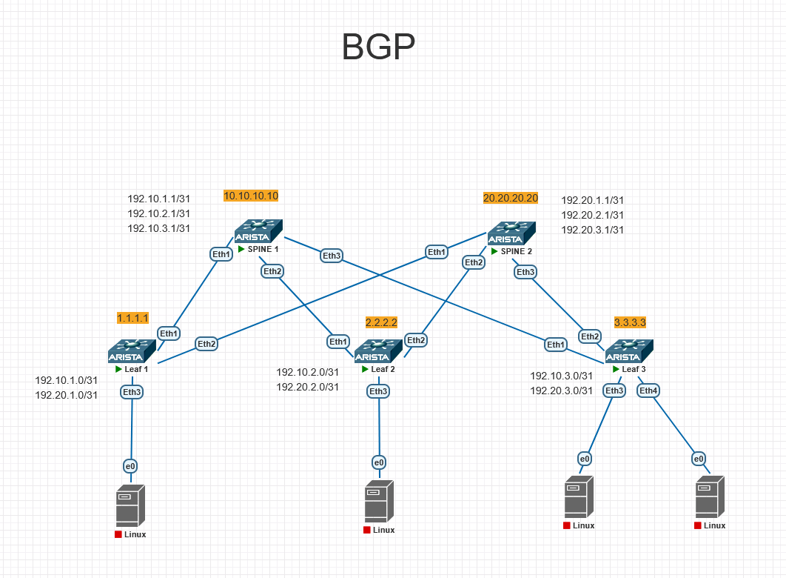

# Underlay. BGP
## Цель: настроить BGP для Underlay сети.

# План работы
## 1. Назначение IP-адресов:
### 1.1 Loopback 0 на каждом устройстве (для Router ID и стабильных соединений).
### 1.2 Транзитные /31 сети на каждом линке Leaf-Spine.
## 2. Настройка BGP
## 3. Верификация: проверка соседств, таблиц маршрутизации и связанности.

-------

## 1. Назначение IP-адресов:
    В проекте будет использоваться CLOS сеть состоящая из двух SPINE и трех Leaf. 

Схема подключения указана на рисунке 1

Рисунок 1.

### 1.1 Loopback 0 на каждом устройстве (для Router ID и стабильных соединений).
Loopback0 на каждом устройстве 

#### Loopback (Router ID / идентификация)
| Устройство | Loopback IP |
|------------|-------------|
| Leaf01 | 1.1.1.1/32 |
| Leaf02 | 2.2.2.2/32 |
| Leaf03 | 3.3.3.3/32 |
| Spine01 | 10.10.10.10/32 |
| Spine02 | 20.20.20.20/32 |

### 1.2 Транзитные /31 сети на каждом линке Leaf-Spine.
Транзитные /31 сети на каждом линке Leaf-Spine.

#### Транзитные /31 линки (Leaf ↔ Spine)
| Линк |	IP Leaf |	IP Spine |
|------|------------|------------|
| Leaf01 – Spine01 |	192.10.1.0/31 |	192.10.1.1/31 |
| Leaf01 – Spine02 |	192.20.1.0/31 |	192.20.1.1/31 |
| Leaf02 – Spine01 |	192.10.2.0/31 |	192.10.2.1/31 |
| Leaf02 – Spine02 |	192.20.2.0/31 |	192.20.2.1/31 |
| Leaf03 – Spine01 |	192.10.3.0/31 |	192.10.3.1/31 |
| Leaf03 – Spine02 |	192.20.3.0/31 |	192.20.3.1/31 |

Все Leaf соединены с обоими Spine. Всего 6 линков.

#### Формирование IP адреса
192 сеть
10 или 20 номер spine (последний октет, где 10 Spine01, а 20 Spine02)
1 или 2 или 3 номер Leaf (последний октет, где 1 Leaf01,  2 Leaf02, 3 Leaf03)


## 2. Настройка BGP
### Leaf01
```bash
configure
hostname Leaf01
ip routing

interface Loopback0
   ip address 1.1.1.1/32
   no shutdown

interface Ethernet1
   description to-Spine01-Eth1
   no switchport 
   no shutdown 
   ip address 192.10.1.0/31 

interface Ethernet2
   description to-Spine02-Eth2
   no switchport 
   no shutdown 
   ip address 192.20.1.0/31   

router bgp 65001
   router-id 1.1.1.1
   network 1.1.1.1/32
   neighbor 192.10.1.1 remote-as 65010
   neighbor 192.10.1.1 description Spine-1
   neighbor 192.20.1.1 remote-as 65020  
   neighbor 192.20.1.1 description Spine-2

end
write memory
```
-----

### Leaf02
```bash
configure
hostname Leaf02
ip routing

interface Loopback0
   ip address 2.2.2.2/32
   no shutdown

interface Ethernet1
   description to-Spine01-Eth1
   no switchport 
   no shutdown 
   ip address 192.10.2.0/31   

interface Ethernet2
   description to-Spine02-Eth2
   no switchport 
   no shutdown 
   ip address 192.20.2.0/31  

router bgp 65002
   router-id 2.2.2.2
   network 2.2.2.2/32
   neighbor 192.10.2.1 remote-as 65010
   neighbor 192.10.2.1 description Spine-1
   neighbor 192.20.2.1 remote-as 65020  
   neighbor 192.20.2.1 description Spine-2

end
write memory
```
------

### Leaf03
```bash
configure
hostname Leaf03
ip routing

interface Loopback0
   ip address 3.3.3.3/32
   no shutdown

interface Ethernet1
   description to-Spine01-Eth1
   no switchport
   no shutdown
   ip address 192.10.3.0/31

interface Ethernet2
   description to-Spine02-Eth2
   no switchport
   no shutdown
   ip address 192.20.3.0/31

router bgp 65003
   router-id 3.3.3.3
   network 3.3.3.3/32
   neighbor 192.10.3.1 remote-as 65010
   neighbor 192.10.3.1 description Spine-1
   neighbor 192.20.3.1 remote-as 65020
   neighbor 192.20.3.1 description Spine-2

end
write memory
```
----

### Spine01
```bash
configure
hostname Spine01
ip routing

interface Loopback0
   ip address 10.10.10.10/32
   no shutdown

interface Ethernet1
   description to-Leaf01-Eth1
   no switchport
   no shutdown
   ip address 192.10.1.1/31

interface Ethernet2
   description to-Leaf02-Eth2
   no switchport
   no shutdown
   ip address 192.10.2.1/31

interface Ethernet3
   description to-Leaf03-Eth3
   no switchport
   no shutdown
   ip address 192.10.3.1/31

router bgp 65010
   router-id 10.10.10.10
   network 10.10.10.10/32
   neighbor 192.10.1.0 remote-as 65001
   neighbor 192.10.1.0 description Leaf-1
   neighbor 192.10.2.0 remote-as 65002
   neighbor 192.10.2.0 description Leaf-2
   neighbor 192.10.3.0 remote-as 65003
   neighbor 192.10.3.0 description Leaf-3

end
write memory
```
---------

### Spine02
```bash
configure
hostname Spine02
ip routing

interface Loopback0
   ip address 20.20.20.20/32
   no shutdown

interface Ethernet1
   description to-Leaf01-Eth1
   no switchport
   no shutdown
   ip address 192.20.1.1/31

interface Ethernet2
   description to-Leaf02-Eth2
   no switchport
   no shutdown
   ip address 192.20.2.1/31

interface Ethernet3
   description to-Leaf03-Eth3
   no switchport
   no shutdown
   ip address 192.20.3.1/31

router bgp 65020
   router-id 20.20.20.20
   network 20.20.20.20/32
   neighbor 192.20.1.0 remote-as 65001
   neighbor 192.20.1.0 description Leaf-1
   neighbor 192.20.2.0 remote-as 65002
   neighbor 192.20.2.0 description Leaf-2
   neighbor 192.20.3.0 remote-as 65003
   neighbor 192.20.3.0 description Leaf-3

end
write memory
```
## 3. Верификация: проверка соседств, таблиц маршрутизации и связанности.
### Spine01
#### show ip bgp summary
```
BGP summary information for VRF default
Router identifier 10.10.10.10, local AS number 65010
Neighbor Status Codes: m - Under maintenance
  Description              Neighbor         V  AS           MsgRcvd   MsgSent  InQ OutQ  Up/Down State   PfxRcd PfxAcc
  Leaf-1                   192.10.1.0       4  65001             19        20    0    0 00:13:53 Estab   2      2
  Leaf-2                   192.10.2.0       4  65002             19        21    0    0 00:13:30 Estab   2      2
  Leaf-3                   192.10.3.0       4  65003             19        21    0    0 00:13:46 Estab   2      2
```
----
#### show ip bgp
```
BGP routing table information for VRF default
Router identifier 10.10.10.10, local AS number 65010
Route status codes: * - valid, > - active, # - not installed, E - ECMP head, e - ECMP
                    S - Stale, c - Contributing to ECMP, b - backup, L - labeled-unicast
Origin codes: i - IGP, e - EGP, ? - incomplete
AS Path Attributes: Or-ID - Originator ID, C-LST - Cluster List, LL Nexthop - Link Local Nexthop

         Network                Next Hop            Metric  LocPref Weight  Path
 * >     1.1.1.1/32             192.10.1.0            0       100     0       65001 i
 * >     2.2.2.2/32             192.10.2.0            0       100     0       65002 i
 * >     3.3.3.3/32             192.10.3.0            0       100     0       65003 i
 * >     10.10.10.10/32         -                     0       0       -       i
 * >     20.20.20.20/32         192.10.1.0            0       100     0       65001 65020 i
 *       20.20.20.20/32         192.10.2.0            0       100     0       65002 65020 i
 *       20.20.20.20/32         192.10.3.0            0       100     0       65003 65020 i
Spine01#
Spine01#show ip interface brief
                                                                        Address
Interface       IP Address         Status      Protocol          MTU    Owner
--------------- ------------------ ----------- ------------- ---------- -------
Ethernet1       192.10.1.1/31      up          up               1500
Ethernet2       192.10.2.1/31      up          up               1500
Ethernet3       192.10.3.1/31      up          up               1500
Loopback0       10.10.10.10/32     up          up              65535
Management1     unassigned         down        down             1500

```
----
#### show ip interface brief
```
Spine01#show ip interface brief
                                                                        Address
Interface       IP Address         Status      Protocol          MTU    Owner
--------------- ------------------ ----------- ------------- ---------- -------
Ethernet1       192.10.1.1/31      up          up               1500
Ethernet2       192.10.2.1/31      up          up               1500
Ethernet3       192.10.3.1/31      up          up               1500
Loopback0       10.10.10.10/32     up          up              65535
Management1     unassigned         down        down             1500
```
----
#### ip route bgp
```
Spine01#show ip route bgp

VRF: default
Codes: C - connected, S - static, K - kernel,
       O - OSPF, IA - OSPF inter area, E1 - OSPF external type 1,
       E2 - OSPF external type 2, N1 - OSPF NSSA external type 1,
       N2 - OSPF NSSA external type2, B - Other BGP Routes,
       B I - iBGP, B E - eBGP, R - RIP, I L1 - IS-IS level 1,
       I L2 - IS-IS level 2, O3 - OSPFv3, A B - BGP Aggregate,
       A O - OSPF Summary, NG - Nexthop Group Static Route,
       V - VXLAN Control Service, M - Martian,
       DH - DHCP client installed default route,
       DP - Dynamic Policy Route, L - VRF Leaked,
       G  - gRIBI, RC - Route Cache Route

 B E      1.1.1.1/32 [200/0] via 192.10.1.0, Ethernet1
 B E      2.2.2.2/32 [200/0] via 192.10.2.0, Ethernet2
 B E      3.3.3.3/32 [200/0] via 192.10.3.0, Ethernet3
 B E      20.20.20.20/32 [200/0] via 192.10.1.0, Ethernet1
```
----
### show running-config | section bgp
```
Spine01#show running-config | section bgp
router bgp 65010
   router-id 10.10.10.10
   neighbor 192.10.1.0 remote-as 65001
   neighbor 192.10.1.0 description Leaf-1
   neighbor 192.10.2.0 remote-as 65002
   neighbor 192.10.2.0 description Leaf-2
   neighbor 192.10.3.0 remote-as 65003
   neighbor 192.10.3.0 description Leaf-3
   network 10.10.10.10/32
Spine01#
```
----
#### ping
```
Spine01#ping 1.1.1.1 source 10.10.10.10
PING 1.1.1.1 (1.1.1.1) from 10.10.10.10 : 72(100) bytes of data.
80 bytes from 1.1.1.1: icmp_seq=1 ttl=64 time=7.21 ms
80 bytes from 1.1.1.1: icmp_seq=2 ttl=64 time=4.45 ms
80 bytes from 1.1.1.1: icmp_seq=3 ttl=64 time=3.97 ms
80 bytes from 1.1.1.1: icmp_seq=4 ttl=64 time=4.23 ms
80 bytes from 1.1.1.1: icmp_seq=5 ttl=64 time=4.64 ms

--- 1.1.1.1 ping statistics ---
5 packets transmitted, 5 received, 0% packet loss, time 28ms
rtt min/avg/max/mdev = 3.972/4.902/7.211/1.177 ms, ipg/ewma 7.134/6.023 ms
Spine01#ping 2.2.2.2 source 10.10.10.10
PING 2.2.2.2 (2.2.2.2) from 10.10.10.10 : 72(100) bytes of data.
80 bytes from 2.2.2.2: icmp_seq=1 ttl=64 time=8.46 ms
80 bytes from 2.2.2.2: icmp_seq=2 ttl=64 time=4.11 ms
80 bytes from 2.2.2.2: icmp_seq=3 ttl=64 time=4.19 ms
80 bytes from 2.2.2.2: icmp_seq=4 ttl=64 time=3.45 ms
80 bytes from 2.2.2.2: icmp_seq=5 ttl=64 time=3.99 ms

--- 2.2.2.2 ping statistics ---
5 packets transmitted, 5 received, 0% packet loss, time 32ms
rtt min/avg/max/mdev = 3.454/4.844/8.464/1.829 ms, ipg/ewma 8.151/6.584 ms
Spine01#ping 3.3.3.3 source 10.10.10.10
PING 3.3.3.3 (3.3.3.3) from 10.10.10.10 : 72(100) bytes of data.
80 bytes from 3.3.3.3: icmp_seq=1 ttl=64 time=6.09 ms
80 bytes from 3.3.3.3: icmp_seq=2 ttl=64 time=5.22 ms
80 bytes from 3.3.3.3: icmp_seq=3 ttl=64 time=4.40 ms
80 bytes from 3.3.3.3: icmp_seq=4 ttl=64 time=3.36 ms
80 bytes from 3.3.3.3: icmp_seq=5 ttl=64 time=4.39 ms

--- 3.3.3.3 ping statistics ---
5 packets transmitted, 5 received, 0% packet loss, time 28ms
rtt min/avg/max/mdev = 3.362/4.696/6.097/0.919 ms, ipg/ewma 7.154/5.350 ms
Spine01#ping 20.20.20.20 source 10.10.10.10
PING 20.20.20.20 (20.20.20.20) from 10.10.10.10 : 72(100) bytes of data.
80 bytes from 20.20.20.20: icmp_seq=1 ttl=63 time=10.6 ms
80 bytes from 20.20.20.20: icmp_seq=2 ttl=63 time=7.22 ms
80 bytes from 20.20.20.20: icmp_seq=3 ttl=63 time=7.27 ms
80 bytes from 20.20.20.20: icmp_seq=4 ttl=63 time=7.84 ms
80 bytes from 20.20.20.20: icmp_seq=5 ttl=63 time=7.10 ms

--- 20.20.20.20 ping statistics ---
5 packets transmitted, 5 received, 0% packet loss, time 41ms
rtt min/avg/max/mdev = 7.108/8.028/10.693/1.359 ms, ipg/ewma 10.379/9.315 ms
Spine01#
```
---- 

### show ip route
```
Spine01#show ip route

VRF: default
Codes: C - connected, S - static, K - kernel,
       O - OSPF, IA - OSPF inter area, E1 - OSPF external type 1,
       E2 - OSPF external type 2, N1 - OSPF NSSA external type 1,
       N2 - OSPF NSSA external type2, B - Other BGP Routes,
       B I - iBGP, B E - eBGP, R - RIP, I L1 - IS-IS level 1,
       I L2 - IS-IS level 2, O3 - OSPFv3, A B - BGP Aggregate,
       A O - OSPF Summary, NG - Nexthop Group Static Route,
       V - VXLAN Control Service, M - Martian,
       DH - DHCP client installed default route,
       DP - Dynamic Policy Route, L - VRF Leaked,
       G  - gRIBI, RC - Route Cache Route

Gateway of last resort is not set

 B E      1.1.1.1/32 [200/0] via 192.10.1.0, Ethernet1
 B E      2.2.2.2/32 [200/0] via 192.10.2.0, Ethernet2
 B E      3.3.3.3/32 [200/0] via 192.10.3.0, Ethernet3
 C        10.10.10.10/32 is directly connected, Loopback0
 B E      20.20.20.20/32 [200/0] via 192.10.1.0, Ethernet1
 C        192.10.1.0/31 is directly connected, Ethernet1
 C        192.10.2.0/31 is directly connected, Ethernet2
 C        192.10.3.0/31 is directly connected, Ethernet3

```
----

### Spine02
#### show ip bgp summary
```
Spine02#show ip bgp summary
BGP summary information for VRF default
Router identifier 20.20.20.20, local AS number 65020
Neighbor Status Codes: m - Under maintenance
  Description              Neighbor         V  AS           MsgRcvd   MsgSent  InQ OutQ  Up/Down State   PfxRcd PfxAcc
  Leaf-1                   192.20.1.0       4  65001             82        81    0    0 01:14:36 Estab   4      4
  Leaf-2                   192.20.2.0       4  65002             82        82    0    0 01:14:16 Estab   4      4
  Leaf-3                   192.20.3.0       4  65003             82        82    0    0 01:14:32 Estab   4      4
```
----
#### show ip bgp
```
Spine02#show ip bgp
BGP routing table information for VRF default
Router identifier 20.20.20.20, local AS number 65020
Route status codes: * - valid, > - active, # - not installed, E - ECMP head, e - ECMP
                    S - Stale, c - Contributing to ECMP, b - backup, L - labeled-unicast
Origin codes: i - IGP, e - EGP, ? - incomplete
AS Path Attributes: Or-ID - Originator ID, C-LST - Cluster List, LL Nexthop - Link Local Nexthop

         Network                Next Hop            Metric  LocPref Weight  Path
 * >     1.1.1.1/32             192.20.1.0            0       100     0       65001 i
 *       1.1.1.1/32             192.20.2.0            0       100     0       65002 65010 65001 i
 *       1.1.1.1/32             192.20.3.0            0       100     0       65003 65010 65001 i
 * >     2.2.2.2/32             192.20.2.0            0       100     0       65002 i
 *       2.2.2.2/32             192.20.1.0            0       100     0       65001 65010 65002 i
 *       2.2.2.2/32             192.20.3.0            0       100     0       65003 65010 65002 i
 * >     3.3.3.3/32             192.20.3.0            0       100     0       65003 i
 *       3.3.3.3/32             192.20.1.0            0       100     0       65001 65010 65003 i
 *       3.3.3.3/32             192.20.2.0            0       100     0       65002 65010 65003 i
 * >     10.10.10.10/32         192.20.1.0            0       100     0       65001 65010 i
 *       10.10.10.10/32         192.20.2.0            0       100     0       65002 65010 i
 *       10.10.10.10/32         192.20.3.0            0       100     0       65003 65010 i
 * >     20.20.20.20/32         -                     0       0       -       i
```
----
#### show ip interface brief
```
Spine02#show ip interface brief
                                                                        Address
Interface       IP Address         Status      Protocol          MTU    Owner
--------------- ------------------ ----------- ------------- ---------- -------
Ethernet1       192.20.1.1/31      up          up               1500
Ethernet2       192.20.2.1/31      up          up               1500
Ethernet3       192.20.3.1/31      up          up               1500
Loopback0       20.20.20.20/32     up          up              65535
Management1     unassigned         down        down             1500
```

#### show running-config | section bgp
```
Spine02#show running-config | section bgp
router bgp 65020
   router-id 20.20.20.20
   neighbor 192.20.1.0 remote-as 65001
   neighbor 192.20.1.0 description Leaf-1
   neighbor 192.20.2.0 remote-as 65002
   neighbor 192.20.2.0 description Leaf-2
   neighbor 192.20.3.0 remote-as 65003
   neighbor 192.20.3.0 description Leaf-3
   network 20.20.20.20/32
```
----
#### ping
```
Spine02#ping 1.1.1.1 source 20.20.20.20
PING 1.1.1.1 (1.1.1.1) from 20.20.20.20 : 72(100) bytes of data.
80 bytes from 1.1.1.1: icmp_seq=1 ttl=64 time=6.44 ms
80 bytes from 1.1.1.1: icmp_seq=2 ttl=64 time=3.73 ms
80 bytes from 1.1.1.1: icmp_seq=3 ttl=64 time=3.18 ms
80 bytes from 1.1.1.1: icmp_seq=4 ttl=64 time=3.55 ms
80 bytes from 1.1.1.1: icmp_seq=5 ttl=64 time=3.98 ms

--- 1.1.1.1 ping statistics ---
5 packets transmitted, 5 received, 0% packet loss, time 27ms
rtt min/avg/max/mdev = 3.180/4.179/6.445/1.162 ms, ipg/ewma 6.916/5.281 ms
Spine02#ping 2.2.2.2 source 20.20.20.20
PING 2.2.2.2 (2.2.2.2) from 20.20.20.20 : 72(100) bytes of data.
80 bytes from 2.2.2.2: icmp_seq=1 ttl=64 time=7.61 ms
80 bytes from 2.2.2.2: icmp_seq=2 ttl=64 time=2.97 ms
80 bytes from 2.2.2.2: icmp_seq=3 ttl=64 time=4.11 ms
80 bytes from 2.2.2.2: icmp_seq=4 ttl=64 time=3.44 ms
80 bytes from 2.2.2.2: icmp_seq=5 ttl=64 time=4.45 ms

--- 2.2.2.2 ping statistics ---
5 packets transmitted, 5 received, 0% packet loss, time 30ms
rtt min/avg/max/mdev = 2.977/4.519/7.614/1.631 ms, ipg/ewma 7.639/6.039 ms
Spine02#ping 3.3.3.3 source 20.20.20.20
PING 3.3.3.3 (3.3.3.3) from 20.20.20.20 : 72(100) bytes of data.
80 bytes from 3.3.3.3: icmp_seq=1 ttl=64 time=6.59 ms
80 bytes from 3.3.3.3: icmp_seq=2 ttl=64 time=4.73 ms
80 bytes from 3.3.3.3: icmp_seq=3 ttl=64 time=3.82 ms
80 bytes from 3.3.3.3: icmp_seq=4 ttl=64 time=3.60 ms
80 bytes from 3.3.3.3: icmp_seq=5 ttl=64 time=4.19 ms

--- 3.3.3.3 ping statistics ---
5 packets transmitted, 5 received, 0% packet loss, time 26ms
rtt min/avg/max/mdev = 3.607/4.591/6.594/1.074 ms, ipg/ewma 6.702/5.547 ms
Spine02#ping 10.10.10.10 source 20.20.20.20
PING 10.10.10.10 (10.10.10.10) from 20.20.20.20 : 72(100) bytes of data.
80 bytes from 10.10.10.10: icmp_seq=1 ttl=63 time=12.7 ms
80 bytes from 10.10.10.10: icmp_seq=2 ttl=63 time=8.92 ms
80 bytes from 10.10.10.10: icmp_seq=3 ttl=63 time=9.32 ms
80 bytes from 10.10.10.10: icmp_seq=4 ttl=63 time=7.96 ms
80 bytes from 10.10.10.10: icmp_seq=5 ttl=63 time=8.30 ms

--- 10.10.10.10 ping statistics ---
5 packets transmitted, 5 received, 0% packet loss, time 50ms
rtt min/avg/max/mdev = 7.962/9.443/12.704/1.698 ms, ipg/ewma 12.655/10.995 ms
Spine02#

```
---- 
### show ip route
```
Spine02#show ip route
VRF: default
Codes: C - connected, S - static, K - kernel,
       O - OSPF, IA - OSPF inter area, E1 - OSPF external type 1,
       E2 - OSPF external type 2, N1 - OSPF NSSA external type 1,
       N2 - OSPF NSSA external type2, B - Other BGP Routes,
       B I - iBGP, B E - eBGP, R - RIP, I L1 - IS-IS level 1,
       I L2 - IS-IS level 2, O3 - OSPFv3, A B - BGP Aggregate,
       A O - OSPF Summary, NG - Nexthop Group Static Route,
       V - VXLAN Control Service, M - Martian,
       DH - DHCP client installed default route,
       DP - Dynamic Policy Route, L - VRF Leaked,
       G  - gRIBI, RC - Route Cache Route

Gateway of last resort is not set

 B E      1.1.1.1/32 [200/0] via 192.20.1.0, Ethernet1
 B E      2.2.2.2/32 [200/0] via 192.20.2.0, Ethernet2
 B E      3.3.3.3/32 [200/0] via 192.20.3.0, Ethernet3
 B E      10.10.10.10/32 [200/0] via 192.20.1.0, Ethernet1
 C        20.20.20.20/32 is directly connected, Loopback0
 C        192.20.1.0/31 is directly connected, Ethernet1
 C        192.20.2.0/31 is directly connected, Ethernet2
 C        192.20.3.0/31 is directly connected, Ethernet3
```
----


### Leaf01
#### show ip bgp summary
```
Leaf01#show ip bgp summary
BGP summary information for VRF default
Router identifier 1.1.1.1, local AS number 65001
Neighbor Status Codes: m - Under maintenance
  Description              Neighbor         V  AS           MsgRcvd   MsgSent  InQ OutQ  Up/Down State   PfxRcd PfxAcc
  Spine-1                  192.10.1.1       4  65010             88        87    0    0 01:21:19 Estab   3      3
  Spine-2                  192.20.1.1       4  65020             88        89    0    0 01:21:17 Estab   3      3
```
----
#### show ip bgp
```
Leaf01#show ip bgp
BGP routing table information for VRF default
Router identifier 1.1.1.1, local AS number 65001
Route status codes: * - valid, > - active, # - not installed, E - ECMP head, e - ECMP
                    S - Stale, c - Contributing to ECMP, b - backup, L - labeled-unicast
Origin codes: i - IGP, e - EGP, ? - incomplete
AS Path Attributes: Or-ID - Originator ID, C-LST - Cluster List, LL Nexthop - Link Local Nexthop

         Network                Next Hop            Metric  LocPref Weight  Path
 * >     1.1.1.1/32             -                     0       0       -       i
 * >     2.2.2.2/32             192.10.1.1            0       100     0       65010 65002 i
 *       2.2.2.2/32             192.20.1.1            0       100     0       65020 65002 i
 * >     3.3.3.3/32             192.10.1.1            0       100     0       65010 65003 i
 *       3.3.3.3/32             192.20.1.1            0       100     0       65020 65003 i
 * >     10.10.10.10/32         192.10.1.1            0       100     0       65010 i
 * >     20.20.20.20/32         192.20.1.1            0       100     0       65020 i
```
----
#### show ip interface brief
```
Leaf01#show ip interface brief
                                                                        Address
Interface       IP Address         Status      Protocol          MTU    Owner
--------------- ------------------ ----------- ------------- ---------- -------
Ethernet1       192.10.1.0/31      up          up               1500
Ethernet2       192.20.1.0/31      up          up               1500
Loopback0       1.1.1.1/32         up          up              65535
Management1     unassigned         down        down             1500
```

#### show running-config | section bgp
```
Leaf01#show running-config | section bgp
router bgp 65001
   router-id 1.1.1.1
   neighbor 192.10.1.1 remote-as 65010
   neighbor 192.10.1.1 description Spine-1
   neighbor 192.20.1.1 remote-as 65020
   neighbor 192.20.1.1 description Spine-2
   network 1.1.1.1/32
```
----
#### ping
```
Leaf01#ping 10.10.10.10 source 1.1.1.1
PING 10.10.10.10 (10.10.10.10) from 1.1.1.1 : 72(100) bytes of data.
80 bytes from 10.10.10.10: icmp_seq=1 ttl=64 time=6.26 ms
80 bytes from 10.10.10.10: icmp_seq=2 ttl=64 time=3.20 ms
80 bytes from 10.10.10.10: icmp_seq=3 ttl=64 time=3.67 ms
80 bytes from 10.10.10.10: icmp_seq=4 ttl=64 time=3.94 ms
80 bytes from 10.10.10.10: icmp_seq=5 ttl=64 time=3.85 ms

--- 10.10.10.10 ping statistics ---
5 packets transmitted, 5 received, 0% packet loss, time 27ms
rtt min/avg/max/mdev = 3.206/4.188/6.267/1.073 ms, ipg/ewma 6.908/5.206 ms
Leaf01#ping 20.20.20.20 source 1.1.1.1
PING 20.20.20.20 (20.20.20.20) from 1.1.1.1 : 72(100) bytes of data.
80 bytes from 20.20.20.20: icmp_seq=1 ttl=64 time=5.31 ms
80 bytes from 20.20.20.20: icmp_seq=2 ttl=64 time=5.00 ms
80 bytes from 20.20.20.20: icmp_seq=3 ttl=64 time=4.47 ms
80 bytes from 20.20.20.20: icmp_seq=4 ttl=64 time=3.36 ms
80 bytes from 20.20.20.20: icmp_seq=5 ttl=64 time=3.43 ms

--- 20.20.20.20 ping statistics ---
5 packets transmitted, 5 received, 0% packet loss, time 24ms
rtt min/avg/max/mdev = 3.364/4.318/5.311/0.800 ms, ipg/ewma 6.004/4.758 ms
Leaf01#ping 2.2.2.2 source 1.1.1.1
PING 2.2.2.2 (2.2.2.2) from 1.1.1.1 : 72(100) bytes of data.
80 bytes from 2.2.2.2: icmp_seq=1 ttl=63 time=10.2 ms
80 bytes from 2.2.2.2: icmp_seq=2 ttl=63 time=6.63 ms
80 bytes from 2.2.2.2: icmp_seq=3 ttl=63 time=7.68 ms
80 bytes from 2.2.2.2: icmp_seq=4 ttl=63 time=7.18 ms
80 bytes from 2.2.2.2: icmp_seq=5 ttl=63 time=8.44 ms

--- 2.2.2.2 ping statistics ---
5 packets transmitted, 5 received, 0% packet loss, time 40ms
rtt min/avg/max/mdev = 6.634/8.036/10.231/1.250 ms, ipg/ewma 10.057/9.130 ms
Leaf01#ping 3.3.3.3 source 1.1.1.1
PING 3.3.3.3 (3.3.3.3) from 1.1.1.1 : 72(100) bytes of data.
80 bytes from 3.3.3.3: icmp_seq=1 ttl=63 time=11.0 ms
80 bytes from 3.3.3.3: icmp_seq=2 ttl=63 time=6.83 ms
80 bytes from 3.3.3.3: icmp_seq=3 ttl=63 time=9.16 ms
80 bytes from 3.3.3.3: icmp_seq=4 ttl=63 time=6.58 ms
80 bytes from 3.3.3.3: icmp_seq=5 ttl=63 time=9.66 ms

--- 3.3.3.3 ping statistics ---
5 packets transmitted, 5 received, 0% packet loss, time 48ms
rtt min/avg/max/mdev = 6.583/8.664/11.082/1.723 ms, ipg/ewma 12.073/9.873 ms
Leaf01#
```
---- 
### show ip route
```
Leaf01#show ip route

VRF: default
Codes: C - connected, S - static, K - kernel,
       O - OSPF, IA - OSPF inter area, E1 - OSPF external type 1,
       E2 - OSPF external type 2, N1 - OSPF NSSA external type 1,
       N2 - OSPF NSSA external type2, B - Other BGP Routes,
       B I - iBGP, B E - eBGP, R - RIP, I L1 - IS-IS level 1,
       I L2 - IS-IS level 2, O3 - OSPFv3, A B - BGP Aggregate,
       A O - OSPF Summary, NG - Nexthop Group Static Route,
       V - VXLAN Control Service, M - Martian,
       DH - DHCP client installed default route,
       DP - Dynamic Policy Route, L - VRF Leaked,
       G  - gRIBI, RC - Route Cache Route

Gateway of last resort is not set

 C        1.1.1.1/32 is directly connected, Loopback0
 B E      2.2.2.2/32 [200/0] via 192.10.1.1, Ethernet1
 B E      3.3.3.3/32 [200/0] via 192.10.1.1, Ethernet1
 B E      10.10.10.10/32 [200/0] via 192.10.1.1, Ethernet1
 B E      20.20.20.20/32 [200/0] via 192.20.1.1, Ethernet2
 C        192.10.1.0/31 is directly connected, Ethernet1
 C        192.20.1.0/31 is directly connected, Ethernet2
```
----

### Leaf02
#### show ip bgp summary
```
Leaf02#show ip bgp summary
BGP summary information for VRF default
Router identifier 2.2.2.2, local AS number 65002
Neighbor Status Codes: m - Under maintenance
  Description              Neighbor         V  AS           MsgRcvd   MsgSent  InQ OutQ  Up/Down State   PfxRcd PfxAcc
  Spine-1                  192.10.2.1       4  65010             94        92    0    0 01:27:00 Estab   4      4
  Spine-2                  192.20.2.1       4  65020             94        94    0    0 01:27:00 Estab   4      4
```
----
#### show ip bgp
```
Leaf02#show ip bgp
BGP routing table information for VRF default
Router identifier 2.2.2.2, local AS number 65002
Route status codes: * - valid, > - active, # - not installed, E - ECMP head, e - ECMP
                    S - Stale, c - Contributing to ECMP, b - backup, L - labeled-unicast
Origin codes: i - IGP, e - EGP, ? - incomplete
AS Path Attributes: Or-ID - Originator ID, C-LST - Cluster List, LL Nexthop - Link Local Nexthop

         Network                Next Hop            Metric  LocPref Weight  Path
 * >     1.1.1.1/32             192.10.2.1            0       100     0       65010 65001 i
 *       1.1.1.1/32             192.20.2.1            0       100     0       65020 65001 i
 * >     2.2.2.2/32             -                     0       0       -       i
 * >     3.3.3.3/32             192.10.2.1            0       100     0       65010 65003 i
 *       3.3.3.3/32             192.20.2.1            0       100     0       65020 65003 i
 * >     10.10.10.10/32         192.10.2.1            0       100     0       65010 i
 *       10.10.10.10/32         192.20.2.1            0       100     0       65020 65001 65010 i
 * >     20.20.20.20/32         192.20.2.1            0       100     0       65020 i
 *       20.20.20.20/32         192.10.2.1            0       100     0       65010 65001 65020 i
```
----
#### show ip interface brief
```
Leaf02#show ip interface brief
                                                                        Address
Interface       IP Address         Status      Protocol          MTU    Owner
--------------- ------------------ ----------- ------------- ---------- -------
Ethernet1       192.10.2.0/31      up          up               1500
Ethernet2       192.20.2.0/31      up          up               1500
Loopback0       2.2.2.2/32         up          up              65535
Management1     unassigned         down        down             1500
```
----
#### show running-config | section bgp
```
Leaf02#show running-config | section bgp
router bgp 65002
   router-id 2.2.2.2
   neighbor 192.10.2.1 remote-as 65010
   neighbor 192.10.2.1 description Spine-1
   neighbor 192.20.2.1 remote-as 65020
   neighbor 192.20.2.1 description Spine-2
   network 2.2.2.2/32
```
----
#### ping
```
Leaf02#ping 1.1.1.1 source 2.2.2.2
PING 1.1.1.1 (1.1.1.1) from 2.2.2.2 : 72(100) bytes of data.
80 bytes from 1.1.1.1: icmp_seq=1 ttl=63 time=12.8 ms
80 bytes from 1.1.1.1: icmp_seq=2 ttl=63 time=6.80 ms
80 bytes from 1.1.1.1: icmp_seq=3 ttl=63 time=7.44 ms
80 bytes from 1.1.1.1: icmp_seq=4 ttl=63 time=7.26 ms
80 bytes from 1.1.1.1: icmp_seq=5 ttl=63 time=6.75 ms

--- 1.1.1.1 ping statistics ---
5 packets transmitted, 5 received, 0% packet loss, time 48ms
rtt min/avg/max/mdev = 6.750/8.215/12.813/2.316 ms, ipg/ewma 12.221/10.431 ms
Leaf02#ping 10.10.10.10 source 2.2.2.2
PING 10.10.10.10 (10.10.10.10) from 2.2.2.2 : 72(100) bytes of data.
80 bytes from 10.10.10.10: icmp_seq=1 ttl=64 time=5.22 ms
80 bytes from 10.10.10.10: icmp_seq=2 ttl=64 time=4.30 ms
80 bytes from 10.10.10.10: icmp_seq=3 ttl=64 time=3.44 ms
80 bytes from 10.10.10.10: icmp_seq=4 ttl=64 time=3.83 ms
80 bytes from 10.10.10.10: icmp_seq=5 ttl=64 time=5.14 ms

--- 10.10.10.10 ping statistics ---
5 packets transmitted, 5 received, 0% packet loss, time 26ms
rtt min/avg/max/mdev = 3.443/4.389/5.227/0.707 ms, ipg/ewma 6.601/4.815 ms
Leaf02#ping 20.20.20.20 source 2.2.2.2
PING 20.20.20.20 (20.20.20.20) from 2.2.2.2 : 72(100) bytes of data.
80 bytes from 20.20.20.20: icmp_seq=1 ttl=64 time=5.61 ms
80 bytes from 20.20.20.20: icmp_seq=2 ttl=64 time=4.58 ms
80 bytes from 20.20.20.20: icmp_seq=3 ttl=64 time=4.74 ms
80 bytes from 20.20.20.20: icmp_seq=4 ttl=64 time=3.39 ms
80 bytes from 20.20.20.20: icmp_seq=5 ttl=64 time=5.50 ms

--- 20.20.20.20 ping statistics ---
5 packets transmitted, 5 received, 0% packet loss, time 24ms
rtt min/avg/max/mdev = 3.392/4.768/5.619/0.802 ms, ipg/ewma 6.067/5.190 ms
Leaf02#ping 3.3.3.3 source 2.2.2.2
PING 3.3.3.3 (3.3.3.3) from 2.2.2.2 : 72(100) bytes of data.
80 bytes from 3.3.3.3: icmp_seq=1 ttl=63 time=12.0 ms
80 bytes from 3.3.3.3: icmp_seq=2 ttl=63 time=9.33 ms
80 bytes from 3.3.3.3: icmp_seq=3 ttl=63 time=7.95 ms
80 bytes from 3.3.3.3: icmp_seq=4 ttl=63 time=7.08 ms
80 bytes from 3.3.3.3: icmp_seq=5 ttl=63 time=6.64 ms

--- 3.3.3.3 ping statistics ---
5 packets transmitted, 5 received, 0% packet loss, time 49ms
rtt min/avg/max/mdev = 6.649/8.613/12.042/1.946 ms, ipg/ewma 12.380/10.208 ms
Leaf02#
```
---- 
### show ip route
```
Leaf02#show ip route

VRF: default
Codes: C - connected, S - static, K - kernel,
       O - OSPF, IA - OSPF inter area, E1 - OSPF external type 1,
       E2 - OSPF external type 2, N1 - OSPF NSSA external type 1,
       N2 - OSPF NSSA external type2, B - Other BGP Routes,
       B I - iBGP, B E - eBGP, R - RIP, I L1 - IS-IS level 1,
       I L2 - IS-IS level 2, O3 - OSPFv3, A B - BGP Aggregate,
       A O - OSPF Summary, NG - Nexthop Group Static Route,
       V - VXLAN Control Service, M - Martian,
       DH - DHCP client installed default route,
       DP - Dynamic Policy Route, L - VRF Leaked,
       G  - gRIBI, RC - Route Cache Route

Gateway of last resort is not set

 B E      1.1.1.1/32 [200/0] via 192.10.2.1, Ethernet1
 C        2.2.2.2/32 is directly connected, Loopback0
 B E      3.3.3.3/32 [200/0] via 192.10.2.1, Ethernet1
 B E      10.10.10.10/32 [200/0] via 192.10.2.1, Ethernet1
 B E      20.20.20.20/32 [200/0] via 192.20.2.1, Ethernet2
 C        192.10.2.0/31 is directly connected, Ethernet1
 C        192.20.2.0/31 is directly connected, Ethernet2
```
----

### Leaf03
#### show ip bgp summary
```
Leaf03#show ip bgp summary
BGP summary information for VRF default
Router identifier 3.3.3.3, local AS number 65003
Neighbor Status Codes: m - Under maintenance
  Description              Neighbor         V  AS           MsgRcvd   MsgSent  InQ OutQ  Up/Down State   PfxRcd PfxAcc
  Spine-1                  192.10.3.1       4  65010             98        96    0    0 01:30:51 Estab   4      4
  Spine-2                  192.20.3.1       4  65020             98        98    0    0 01:30:51 Estab   4      4
```
----
#### show ip bgp
```
Leaf03#show ip bgp
BGP routing table information for VRF default
Router identifier 3.3.3.3, local AS number 65003
Route status codes: * - valid, > - active, # - not installed, E - ECMP head, e - ECMP
                    S - Stale, c - Contributing to ECMP, b - backup, L - labeled-unicast
Origin codes: i - IGP, e - EGP, ? - incomplete
AS Path Attributes: Or-ID - Originator ID, C-LST - Cluster List, LL Nexthop - Link Local Nexthop

         Network                Next Hop            Metric  LocPref Weight  Path
 * >     1.1.1.1/32             192.10.3.1            0       100     0       65010 65001 i
 *       1.1.1.1/32             192.20.3.1            0       100     0       65020 65001 i
 * >     2.2.2.2/32             192.10.3.1            0       100     0       65010 65002 i
 *       2.2.2.2/32             192.20.3.1            0       100     0       65020 65002 i
 * >     3.3.3.3/32             -                     0       0       -       i
 * >     10.10.10.10/32         192.10.3.1            0       100     0       65010 i
 *       10.10.10.10/32         192.20.3.1            0       100     0       65020 65001 65010 i
 * >     20.20.20.20/32         192.20.3.1            0       100     0       65020 i
 *       20.20.20.20/32         192.10.3.1            0       100     0       65010 65001 65020 i
```
----
#### show ip interface brief
```
Leaf03#show ip interface brief
                                                                        Address
Interface       IP Address         Status      Protocol          MTU    Owner
--------------- ------------------ ----------- ------------- ---------- -------
Ethernet1       192.10.3.0/31      up          up               1500
Ethernet2       192.20.3.0/31      up          up               1500
Loopback0       3.3.3.3/32         up          up              65535
Management1     unassigned         down        down             1500
```

#### show running-config | section bgp
```
Leaf03#show running-config | section bgp
router bgp 65003
   router-id 3.3.3.3
   neighbor 192.10.3.1 remote-as 65010
   neighbor 192.10.3.1 description Spine-1
   neighbor 192.20.3.1 remote-as 65020
   neighbor 192.20.3.1 description Spine-2
   network 3.3.3.3/32
```
----

#### ping
```
Leaf03#ping 1.1.1.1 source 3.3.3.3
PING 1.1.1.1 (1.1.1.1) from 3.3.3.3 : 72(100) bytes of data.
80 bytes from 1.1.1.1: icmp_seq=1 ttl=63 time=10.8 ms
80 bytes from 1.1.1.1: icmp_seq=2 ttl=63 time=8.28 ms
80 bytes from 1.1.1.1: icmp_seq=3 ttl=63 time=8.85 ms
80 bytes from 1.1.1.1: icmp_seq=4 ttl=63 time=7.06 ms
80 bytes from 1.1.1.1: icmp_seq=5 ttl=63 time=6.84 ms

--- 1.1.1.1 ping statistics ---
5 packets transmitted, 5 received, 0% packet loss, time 46ms
rtt min/avg/max/mdev = 6.843/8.376/10.840/1.446 ms, ipg/ewma 11.686/9.523 ms
Leaf03#ping 2.2.2.2 source 3.3.3.3
PING 2.2.2.2 (2.2.2.2) from 3.3.3.3 : 72(100) bytes of data.
80 bytes from 2.2.2.2: icmp_seq=1 ttl=63 time=11.2 ms
80 bytes from 2.2.2.2: icmp_seq=2 ttl=63 time=7.71 ms
80 bytes from 2.2.2.2: icmp_seq=3 ttl=63 time=8.09 ms
80 bytes from 2.2.2.2: icmp_seq=4 ttl=63 time=8.01 ms
80 bytes from 2.2.2.2: icmp_seq=5 ttl=63 time=7.83 ms

--- 2.2.2.2 ping statistics ---
5 packets transmitted, 5 received, 0% packet loss, time 45ms
rtt min/avg/max/mdev = 7.712/8.571/11.204/1.325 ms, ipg/ewma 11.289/9.843 ms
Leaf03#ping 10.10.10.10 source 3.3.3.3
PING 10.10.10.10 (10.10.10.10) from 3.3.3.3 : 72(100) bytes of data.
80 bytes from 10.10.10.10: icmp_seq=1 ttl=64 time=4.97 ms
80 bytes from 10.10.10.10: icmp_seq=2 ttl=64 time=4.26 ms
80 bytes from 10.10.10.10: icmp_seq=3 ttl=64 time=3.17 ms
80 bytes from 10.10.10.10: icmp_seq=4 ttl=64 time=3.17 ms
80 bytes from 10.10.10.10: icmp_seq=5 ttl=64 time=3.32 ms

--- 10.10.10.10 ping statistics ---
5 packets transmitted, 5 received, 0% packet loss, time 25ms
rtt min/avg/max/mdev = 3.172/3.782/4.975/0.725 ms, ipg/ewma 6.288/4.340 ms
Leaf03#ping 20.20.20.20 source 3.3.3.3
PING 20.20.20.20 (20.20.20.20) from 3.3.3.3 : 72(100) bytes of data.
80 bytes from 20.20.20.20: icmp_seq=1 ttl=64 time=5.52 ms
80 bytes from 20.20.20.20: icmp_seq=2 ttl=64 time=5.24 ms
80 bytes from 20.20.20.20: icmp_seq=3 ttl=64 time=40.1 ms
80 bytes from 20.20.20.20: icmp_seq=4 ttl=64 time=17.1 ms
80 bytes from 20.20.20.20: icmp_seq=5 ttl=64 time=25.2 ms

--- 20.20.20.20 ping statistics ---
5 packets transmitted, 5 received, 0% packet loss, time 59ms
rtt min/avg/max/mdev = 5.244/18.660/40.184/13.128 ms, pipe 2, ipg/ewma 14.757/12.547 ms
Leaf03#

```
---- 
### show ip route
```
Leaf03#show ip route

VRF: default
Codes: C - connected, S - static, K - kernel,
       O - OSPF, IA - OSPF inter area, E1 - OSPF external type 1,
       E2 - OSPF external type 2, N1 - OSPF NSSA external type 1,
       N2 - OSPF NSSA external type2, B - Other BGP Routes,
       B I - iBGP, B E - eBGP, R - RIP, I L1 - IS-IS level 1,
       I L2 - IS-IS level 2, O3 - OSPFv3, A B - BGP Aggregate,
       A O - OSPF Summary, NG - Nexthop Group Static Route,
       V - VXLAN Control Service, M - Martian,
       DH - DHCP client installed default route,
       DP - Dynamic Policy Route, L - VRF Leaked,
       G  - gRIBI, RC - Route Cache Route

Gateway of last resort is not set

 B E      1.1.1.1/32 [200/0] via 192.10.3.1, Ethernet1
 B E      2.2.2.2/32 [200/0] via 192.10.3.1, Ethernet1
 C        3.3.3.3/32 is directly connected, Loopback0
 B E      10.10.10.10/32 [200/0] via 192.10.3.1, Ethernet1
 B E      20.20.20.20/32 [200/0] via 192.20.3.1, Ethernet2
 C        192.10.3.0/31 is directly connected, Ethernet1
 C        192.20.3.0/31 is directly connected, Ethernet2
```
